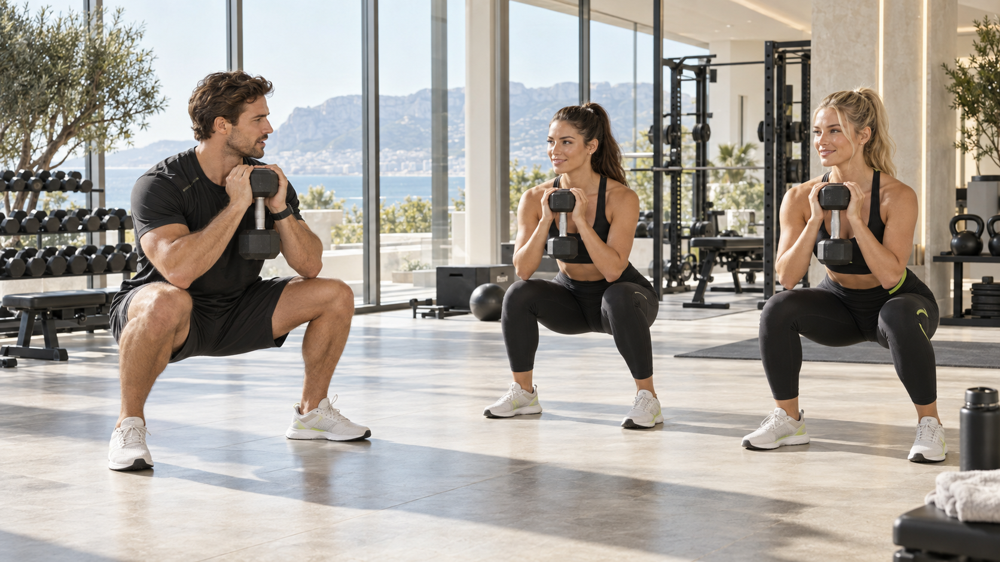
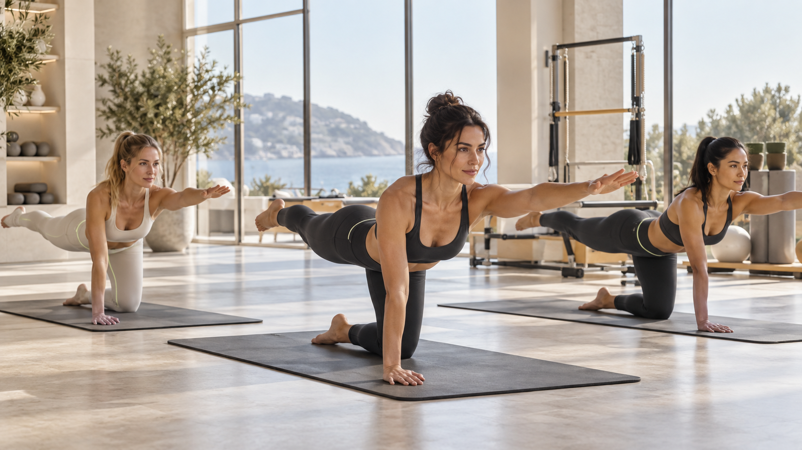
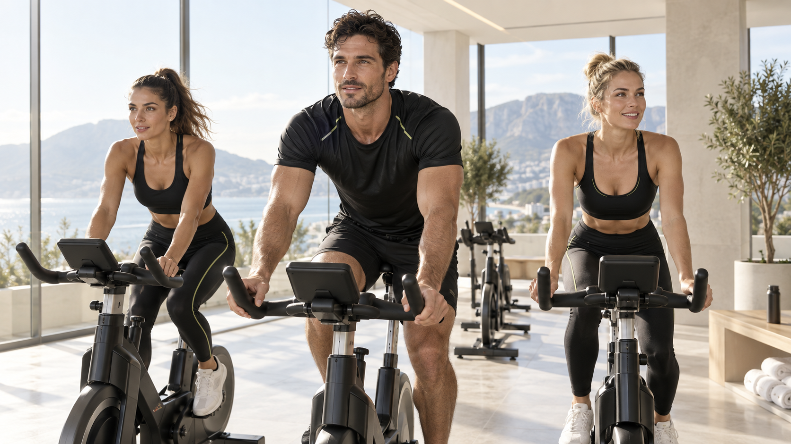
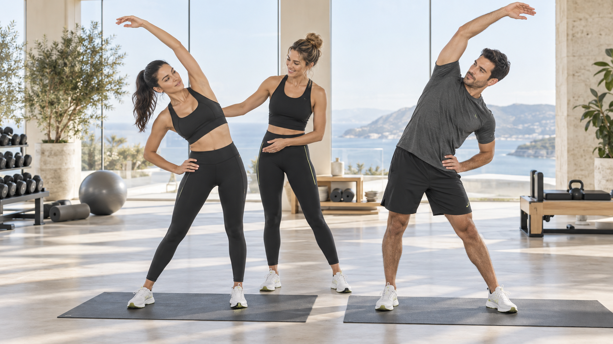
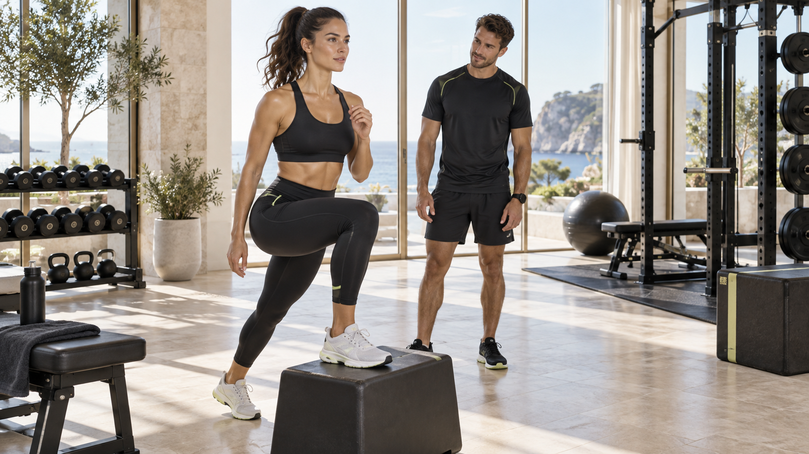

# GYM COURSES 05

## C01 · Strength Foundations

La forza comincia dalla tecnica.

Un corso guidato per familiarizzare con squat, movimento dell’anca, spinte e tirate. Si lavora con carichi gestibili, pause chiare e attenzione alla qualità del gesto.

**Base · 45 min**

**Attrezzatura:** Manubri, Kettlebell, Panche, Tappetini

### Obiettivi

- Imparare i movimenti fondamentali
- Gestire un carico adatto
- Costruire continuità

### Struttura della lezione

**Preparazione · 8 min**

Mobilità dolce e attivazione generale.

**Tecnica · 10 min**

Dimostrazione e prove di goblet squat e hip hinge senza fretta.

**Circuito guidato · 22 min**

Squat, rematore e push-up inclinato; 3 giri da 8–10 ripetizioni, 45–60 secondi di recupero, con correzioni del trainer.

**Chiusura · 5 min**

Camminata facile e riepilogo tecnico.

**Porta con te:** Abbigliamento sportivo comodo, Acqua, Asciugamano

Presentati qualche minuto prima e comunica all’istruttore il tuo livello e le eventuali limitazioni.

Il trainer adatta carichi, ampiezza e ritmo al gruppo.

**Allenamenti collegati:** W01, W07, W16

Calendario, sede e istruttore da definire.

**CTA:** Scopri il corso

---

## C02 · Pilates Sculpt

Controllo, respiro, precisione.

Una lezione a terra centrata su controllo del tronco, mobilità e coordinazione. Sequenze accessibili, movimenti lenti e varianti per seguire il proprio livello.

**Base / intermedio · 45 min**

**Attrezzatura:** Tappetini, Miniband opzionali

### Obiettivi

- Migliorare consapevolezza del movimento
- Allenare il controllo del tronco
- Coordinare respiro e gesto

### Struttura della lezione

**Respiro e allineamento · 5 min**

Posizioni comode e respirazione naturale.

**Mobilità · 8 min**

Mobilità della colonna e delle anche senza forzature.

**Sequenza centrale · 25 min**

Toe tap, ponte glutei, bird dog e aperture sul fianco: 2–3 giri da 6–10 ripetizioni controllate, pause a necessità.

**Distensione · 7 min**

Allungamenti dolci e chiusura tranquilla.

**Porta con te:** Abbigliamento sportivo comodo, Acqua, Asciugamano

Presentati qualche minuto prima e comunica all’istruttore il tuo livello e le eventuali limitazioni.

Il trainer adatta carichi, ampiezza e ritmo al gruppo.

**Allenamenti collegati:** W17, W04, W19

Calendario, sede e istruttore da definire.

**CTA:** Scopri il corso

---

## C03 · Ride Studio

Il tuo ritmo, una strada condivisa.

Una sessione di cycling indoor con alternanza di tratti facili e moderati. La musica accompagna la lezione; resistenza e cadenza restano adattabili, senza obbligo di seguire il gruppo.

**Base / intermedio · 45 min**

**Attrezzatura:** Bike indoor

### Obiettivi

- Allenare la continuità aerobica
- Gestire lo sforzo percepito
- Imparare a regolare il ritmo

### Struttura della lezione

**Setup · 5 min**

Regolazione individuale della bike con l’istruttore.

**Riscaldamento · 7 min**

Pedalata progressiva e confortevole.

**Intervalli · 24 min**

6 cicli di 2 minuti moderati e 2 minuti facili, prevalentemente da seduti.

**Defaticamento · 6 min**

Riduzione graduale della resistenza.

**Chiusura · 3 min**

Discesa dalla bike e mobilità leggera.

**Porta con te:** Abbigliamento sportivo comodo, Acqua, Asciugamano

Presentati qualche minuto prima e comunica all’istruttore il tuo livello e le eventuali limitazioni.

Il trainer adatta carichi, ampiezza e ritmo al gruppo.

**Allenamenti collegati:** W14, W05

Calendario, sede e istruttore da definire.

**CTA:** Scopri il corso

---

## C04 · Mobility & Reset

Più spazio al movimento.

Un corso a intensità contenuta per esplorare mobilità di colonna, anche e spalle. Ideale come momento di movimento consapevole, con ampiezze confortevoli e senza forzare gli allungamenti.

**Tutti i livelli · 30 min**

**Attrezzatura:** Tappetini, Parete, Supporti stabili

### Obiettivi

- Esplorare l’ampiezza confortevole
- Interrompere la sedentarietà
- Allenare il controllo

### Struttura della lezione

**Avvio · 4 min**

Marcia comoda e movimenti articolari dolci.

**Mobilità guidata · 18 min**

Cat-cow, rotazioni toraciche, mobilità caviglie e anche; 2 giri lenti con spiegazioni.

**Stabilità · 4 min**

Equilibrio vicino al supporto e scivolate delle braccia alla parete.

**Chiusura · 4 min**

Posizione comoda e respiro naturale.

**Porta con te:** Abbigliamento sportivo comodo, Acqua, Asciugamano

Presentati qualche minuto prima e comunica all’istruttore il tuo livello e le eventuali limitazioni.

Il trainer adatta carichi, ampiezza e ritmo al gruppo.

**Allenamenti collegati:** W11, W12, W18, W19

Calendario, sede e istruttore da definire.

**CTA:** Scopri il corso

---

## C05 · Functional Circuit

Movimenti semplici. Energia di gruppo.

Un circuito di gruppo con stazioni chiare e alternative senza salti. Squat, tirate, passi su rialzo basso e movimenti a corpo libero si alternano con recuperi programmati.

**Base / intermedio · 45 min**

**Attrezzatura:** Manubri, Step basso stabile, Panche, Tappetini

### Obiettivi

- Allenare diversi schemi motori
- Gestire lavoro e recupero
- Muoversi con continuità

### Struttura della lezione

**Riscaldamento · 7 min**

Marcia, mobilità e prove dei movimenti.

**Spiegazione stazioni · 8 min**

Il trainer mostra squat, rematore con appoggio, step-up basso, push-up inclinato e marcia attiva.

**Circuito · 25 min**

5 stazioni × 40 secondi di lavoro + 20 secondi di cambio, per 5 giri. Ridurre ritmo o usare la pausa secondo necessità; nessuna gara di ripetizioni.

**Defaticamento · 5 min**

Camminata lenta e mobilità dolce.

**Porta con te:** Abbigliamento sportivo comodo, Acqua, Asciugamano

Presentati qualche minuto prima e comunica all’istruttore il tuo livello e le eventuali limitazioni.

Il trainer adatta carichi, ampiezza e ritmo al gruppo.

**Allenamenti collegati:** W01, W06, W20

Calendario, sede e istruttore da definire.

**CTA:** Scopri il corso