# GYM DAILIES 20

## M01 · Pancake cacao e lamponi

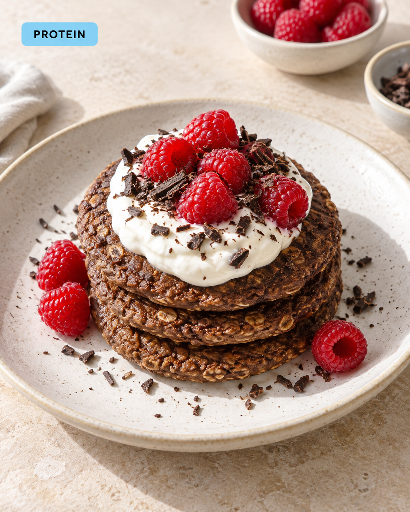

Il lato goloso della tua colazione.

**Colazione · 15 min · 1 porzione · Facile**

**Tag:** PROTEIN

Ricette con un ingrediente proteico centrale. Quantità di proteine e requisiti per eventuali claim nutrizionali non verificati.

### Ingredienti

- 40 g farina di avena
- 1 uovo medio
- 100 g yogurt greco bianco 0%
- 50 ml latte
- 5 g cacao amaro
- 2 g lievito per dolci
- 70 g lamponi
- 5 g cioccolato fondente
- 2 g olio per la padella

### Preparazione

1. Mescola farina, cacao e lievito. Aggiungi uovo, latte e 30 g di yogurt: ottieni una pastella densa.
2. Scalda una padella antiaderente con l’olio distribuito con un pennello. Versa tre piccole porzioni.
3. Cuoci a fuoco medio-basso circa 2–3 minuti per lato, finché il centro è cotto.
4. Servi con lo yogurt rimasto, lamponi lavati e cioccolato a scaglie.

**Il tocco in più:** Non schiacciare i pancake mentre cuociono.

**Allergeni:** Uova, Latte, Avena: verificare glutine in etichetta

**CTA:** Scopri la ricetta

---

## M02 · Skyr mango e pistacchio

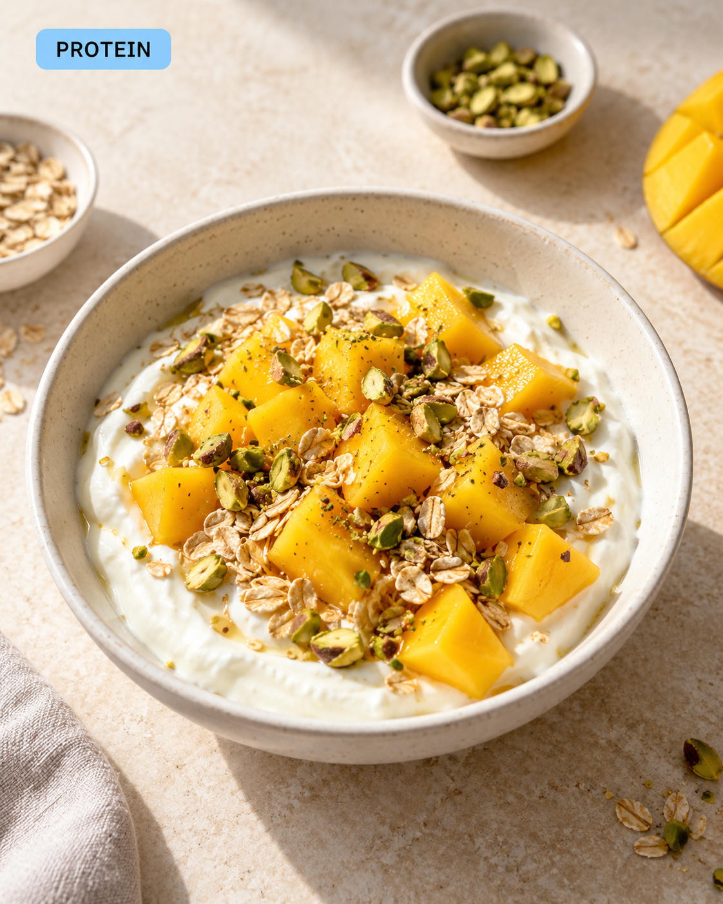

Fresco, cremoso, con il crunch giusto.

**Colazione / spuntino · 5 min · 1 porzione · Facile**

**Tag:** PROTEIN

Ricette con un ingrediente proteico centrale. Quantità di proteine e requisiti per eventuali claim nutrizionali non verificati.

### Ingredienti

- 200 g skyr bianco
- 120 g polpa di mango
- 10 g pistacchi non salati
- 20 g fiocchi di avena

### Preparazione

1. Versa lo skyr in una ciotola e lavoralo con il cucchiaio.
2. Taglia il mango a cubetti.
3. Trita grossolanamente i pistacchi.
4. Distribuisci mango, avena e pistacchi sullo skyr e servi.

**Il tocco in più:** Usa mango maturo: non serve aggiungere sciroppi.

**Allergeni:** Latte, Pistacchi, Avena: verificare glutine in etichetta

**CTA:** Scopri la ricetta

---

## M03 · Overnight oats espresso

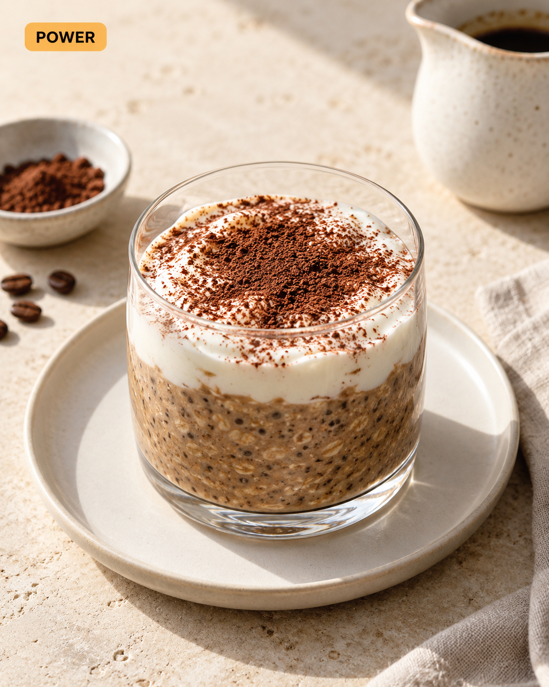

La colazione si prepara mentre tu riposi.

**Colazione · 5 min + 8 ore in frigo · 1 porzione · Facile**

**Tag:** POWER

Pasti con cereali e altri ingredienti per accompagnare giornate attive. Nessuna promessa di aumento della forza.

### Ingredienti

- 45 g fiocchi di avena
- 150 g yogurt greco bianco
- 60 ml latte
- 30 ml espresso freddo anche decaffeinato
- 3 g cacao amaro

### Preparazione

1. Mescola avena, latte, espresso freddo e 100 g di yogurt in un contenitore con coperchio.
2. Chiudi e lascia in frigorifero circa 8 ore.
3. Mescola; se serve aggiungi un cucchiaio d’acqua.
4. Completa con i 50 g di yogurt rimasti e cacao.

**Il tocco in più:** Prepara la sera e consuma la mattina seguente.

**Allergeni:** Latte, Avena: verificare glutine in etichetta

**CTA:** Scopri la ricetta

---

## M04 · Toast uova e avocado

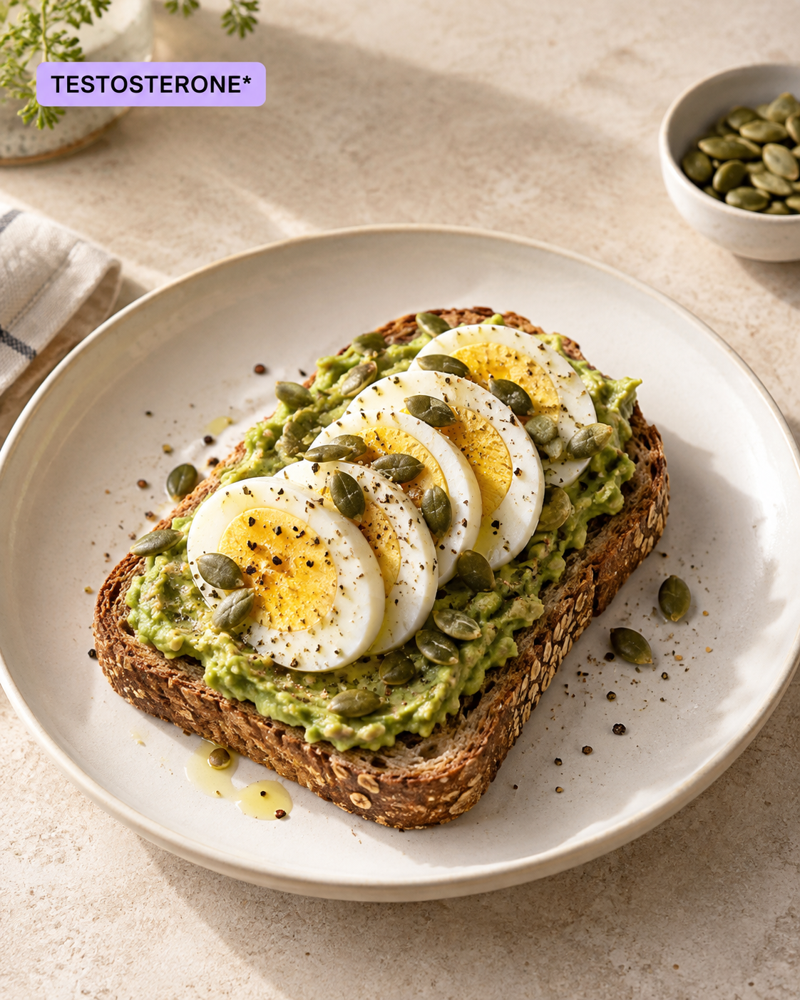

Pochi ingredienti, un morso pieno di gusto.

**Colazione / pranzo leggero · 15 min · 1 porzione · Facile**

**Tag:** TESTOSTERONE*

Etichetta tematica richiesta, non beneficio dimostrato. Non è verificato che queste ricette aumentino il testosterone.

### Ingredienti

- 60 g pane integrale
- 1 uovo medio
- 50 g polpa di avocado
- 10 g semi di zucca
- 10 ml succo di limone
- Pepe a piacere

### Preparazione

1. Metti l’uovo in acqua, porta a bollore e cuoci circa 9–10 minuti, fino ad albume e tuorlo sodi. Raffredda e sguscia.
2. Schiaccia l’avocado con il succo di limone.
3. Tosta il pane e spalma l’avocado.
4. Aggiungi l’uovo a fette, i semi di zucca e pepe.

**Il tocco in più:** Il limone mantiene fresco il gusto dell’avocado.

**Allergeni:** Glutine, Uova

**CTA:** Scopri la ricetta

---

## M05 · French toast fragole e yogurt

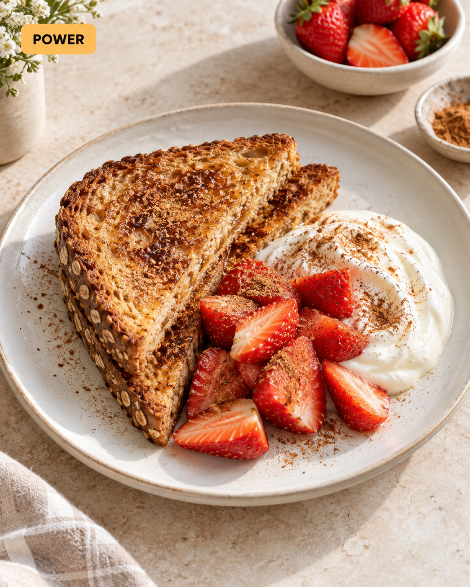

Dorato fuori, morbido dentro.

**Colazione · 15 min · 1 porzione · Facile**

**Tag:** POWER

Pasti con cereali e altri ingredienti per accompagnare giornate attive. Nessuna promessa di aumento della forza.

### Ingredienti

- 60 g pane integrale
- 1 uovo medio
- 40 ml latte
- 100 g yogurt greco bianco
- 120 g fragole
- 2 g olio
- Cannella a piacere

### Preparazione

1. Sbatti uovo e latte con un pizzico di cannella.
2. Immergi brevemente il pane sui due lati.
3. Cuoci in padella antiaderente spennellata d’olio a fuoco medio-basso per circa 3 minuti per lato, finché l’uovo è cotto anche al centro.
4. Servi con yogurt e fragole lavate e tagliate.

**Il tocco in più:** Pane del giorno prima: assorbe bene senza rompersi.

**Allergeni:** Glutine, Uova, Latte

**CTA:** Scopri la ricetta

---

## M06 · Chicken bowl lime e paprika

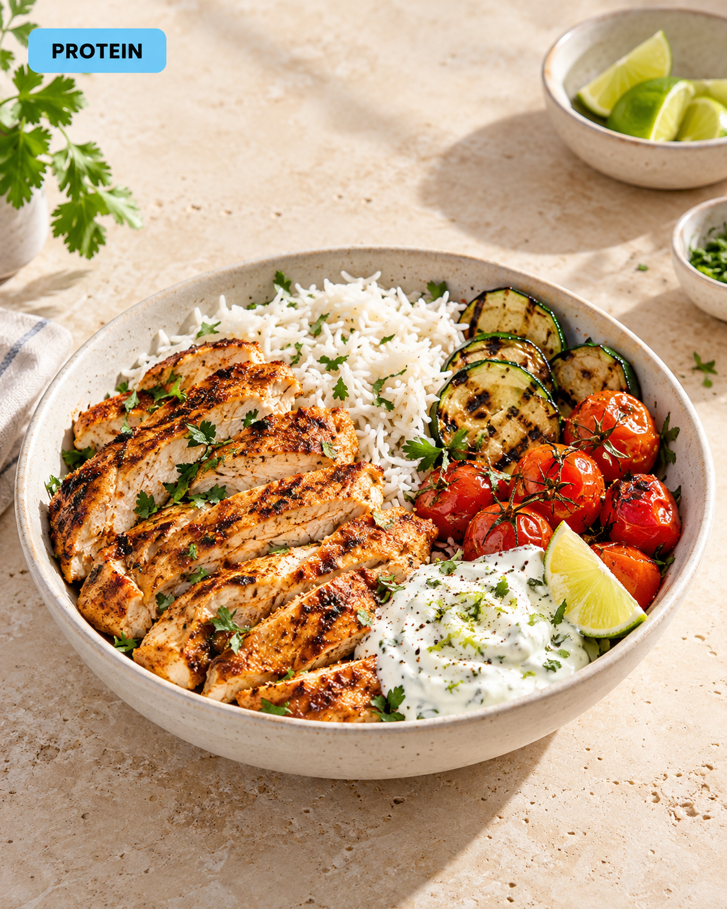

Speziato, fresco, pronto per la tua pausa.

**Pranzo / cena · 25 min · 1 porzione · Facile**

**Tag:** PROTEIN

Ricette con un ingrediente proteico centrale. Quantità di proteine e requisiti per eventuali claim nutrizionali non verificati.

### Ingredienti

- 150 g petto di pollo crudo
- 60 g riso basmati secco
- 150 g zucchine
- 100 g pomodorini
- 50 g yogurt greco
- 5 g olio EVO
- 15 ml succo di lime
- 1 cucchiaino paprika dolce
- Sale e pepe a piacere

### Preparazione

1. Cuoci il riso secondo la confezione.
2. Taglia le zucchine a rondelle e cuocile in padella con metà olio per circa 8 minuti.
3. Condisci il pollo con paprika e olio rimasto. Cuocilo in padella, girandolo, fino a 74 °C al cuore; affettalo con utensili puliti.
4. Mescola yogurt e lime. Componi la bowl con riso, pollo, zucchine e pomodorini lavati, quindi aggiungi la salsa.

**Il tocco in più:** La paprika dolce dà carattere senza coprire il lime.

**Allergeni:** Latte

**CTA:** Scopri la ricetta

---

## M07 · Salmone croccante e patata dolce

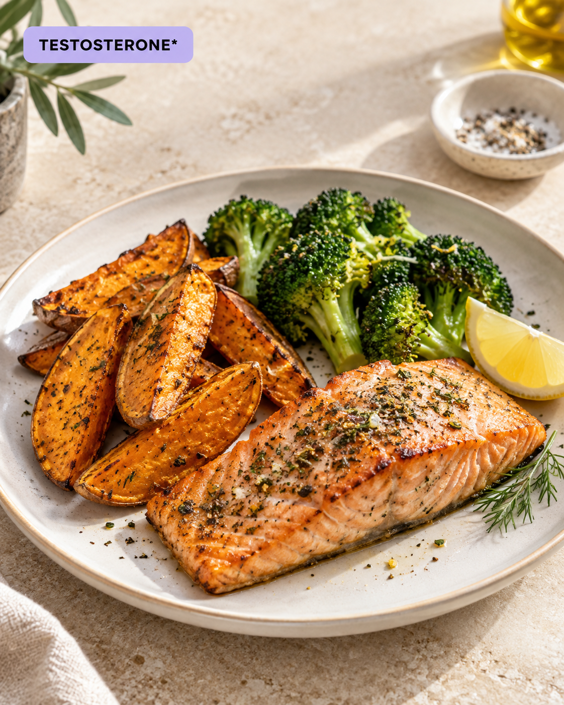

Un piatto unico, colori pieni, zero complicazioni.

**Pranzo / cena · 35 min · 1 porzione · Facile**

**Tag:** TESTOSTERONE*

Etichetta tematica richiesta, non beneficio dimostrato. Non è verificato che queste ricette aumentino il testosterone.

### Ingredienti

- 140 g filetto di salmone crudo
- 180 g patata dolce
- 150 g broccoli
- 5 g olio EVO
- 15 ml succo di limone
- Paprika e pepe a piacere

### Preparazione

1. Scalda il forno statico a 200 °C. Taglia la patata a spicchi sottili e condiscila con metà olio e paprika.
2. Cuoci la patata per 15 minuti su carta forno.
3. Aggiungi salmone e broccoli in piccole cimette, condisci con l’olio rimasto e cuoci altri 12–18 minuti. Il pesce deve raggiungere 63 °C al cuore.
4. Controlla che la patata sia tenera e servi con limone.

**Il tocco in più:** Lascia spazio tra gli spicchi per farli dorare.

**Allergeni:** Pesce

**CTA:** Scopri la ricetta

---

## M08 · Tacos di gamberi e mango

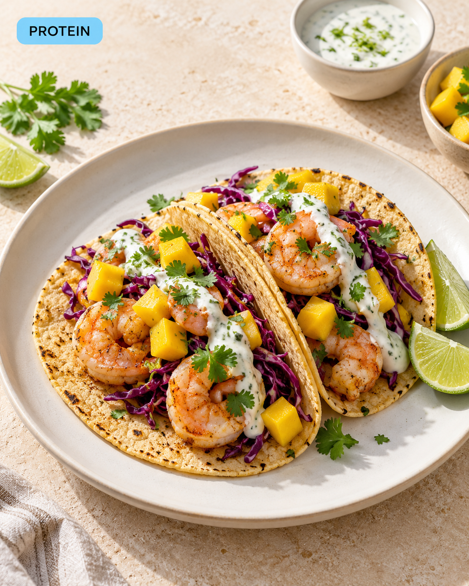

Dolce, fresco e speziato in due tacos.

**Pranzo / cena · 20 min · 1 porzione · Facile**

**Tag:** PROTEIN

Ricette con un ingrediente proteico centrale. Quantità di proteine e requisiti per eventuali claim nutrizionali non verificati.

### Ingredienti

- 2 tortillas di mais da 25 g
- 150 g gamberi crudi sgusciati
- 70 g mango
- 80 g cavolo rosso
- 50 g yogurt greco
- 15 ml succo di lime
- 5 g olio EVO
- Paprika a piacere

### Preparazione

1. Taglia mango a cubetti e cavolo a strisce sottili. Lava le verdure.
2. Mescola yogurt e lime.
3. Cuoci i gamberi con olio e paprika circa 2–3 minuti per lato, fino a polpa opaca e perlata.
4. Scalda le tortillas, farcisci con cavolo, gamberi e mango e completa con la salsa.

**Il tocco in più:** Scalda le tortillas solo al momento di farcirle.

**Allergeni:** Crostacei, Latte, Verificare eventuale glutine nelle tortillas

**CTA:** Scopri la ricetta

---

## M09 · Polpette di tacchino al pomodoro

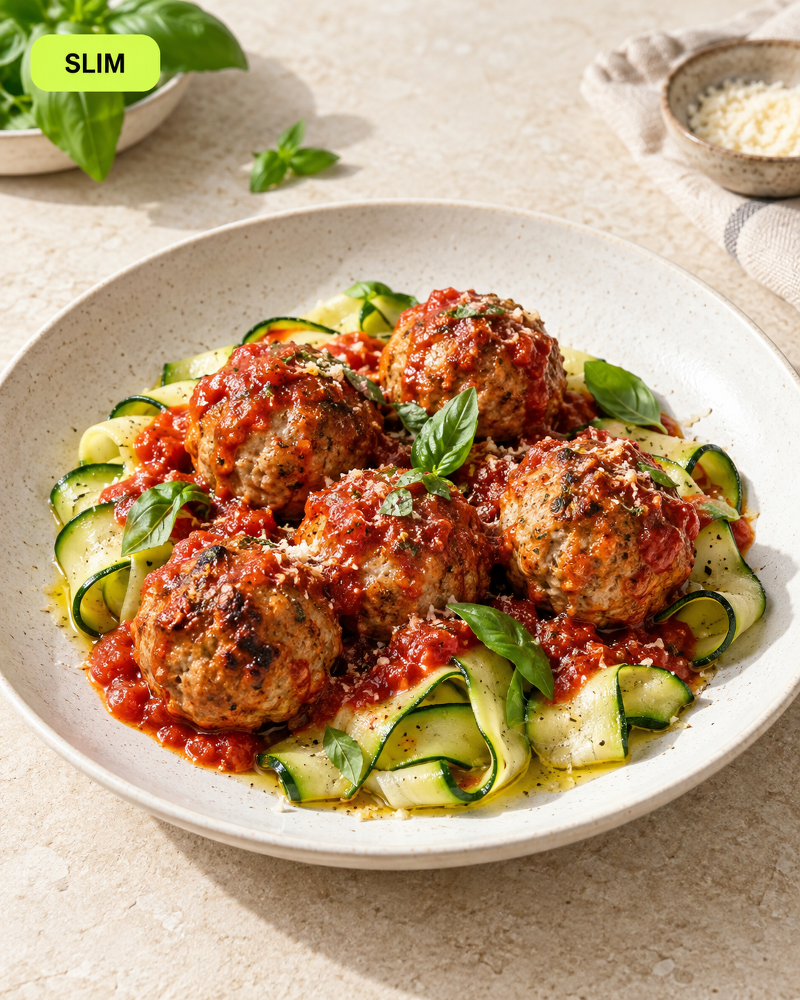

Comfort food con una base di zucchine.

**Pranzo / cena · 25 min · 1 porzione · Facile**

**Tag:** SLIM

Selezione editoriale di piatti con porzioni definite e condimenti misurati. Non certifica basso contenuto calorico e non garantisce dimagrimento.

### Ingredienti

- 150 g macinato di tacchino
- 10 g pangrattato
- 15 ml latte
- 150 g passata di pomodoro
- 250 g zucchine
- 5 g olio EVO
- Basilico, pepe e sale a piacere

### Preparazione

1. Ammorbidisci il pangrattato nel latte e mescolalo con tacchino e pepe. Forma 5 piccole polpette.
2. Scalda metà olio e fai dorare le polpette per 3 minuti girandole.
3. Aggiungi la passata, copri e cuoci a fuoco basso circa 12–15 minuti, fino a 74 °C al cuore.
4. Ricava nastri dalle zucchine con un pelapatate; saltali 2–3 minuti con l’olio rimasto. Servi con polpette e basilico.

**Il tocco in più:** Mantieni le zucchine appena croccanti.

**Allergeni:** Glutine, Latte

**CTA:** Scopri la ricetta

---

## M10 · Pasta al pesto di piselli

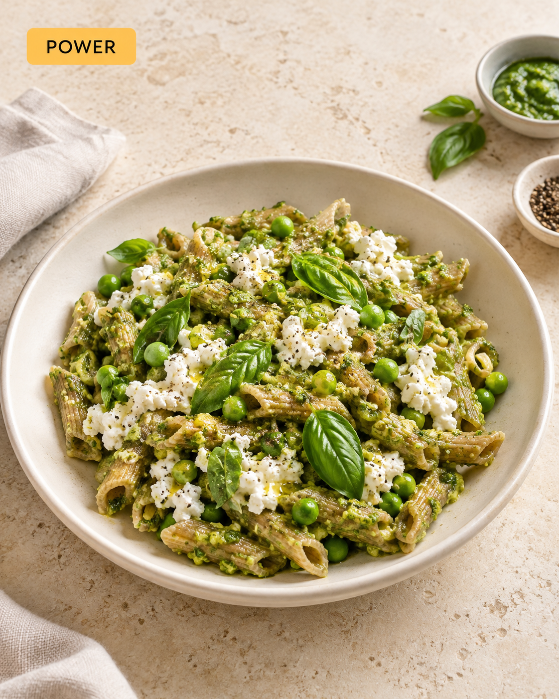

Verde brillante, cremosa senza panna.

**Pranzo / cena · 20 min · 1 porzione · Facile**

**Tag:** POWER

Pasti con cereali e altri ingredienti per accompagnare giornate attive. Nessuna promessa di aumento della forza.

### Ingredienti

- 70 g pasta integrale secca
- 100 g piselli surgelati
- 100 g fiocchi di latte
- 5 g olio EVO
- 5 foglie basilico
- 10 ml succo di limone
- Sale e pepe a piacere

### Preparazione

1. Cuoci i piselli in acqua bollente per il tempo indicato sulla confezione.
2. Cuoci la pasta e conserva una tazzina d’acqua di cottura.
3. Frulla i piselli con olio, basilico, limone e poca acqua di cottura.
4. Condisci la pasta e completa con i fiocchi di latte.

**Il tocco in più:** Aggiungi l’acqua poco alla volta per ottenere una crema.

**Allergeni:** Glutine, Latte

**CTA:** Scopri la ricetta

---

## M11 · Bowl tofu e sesamo

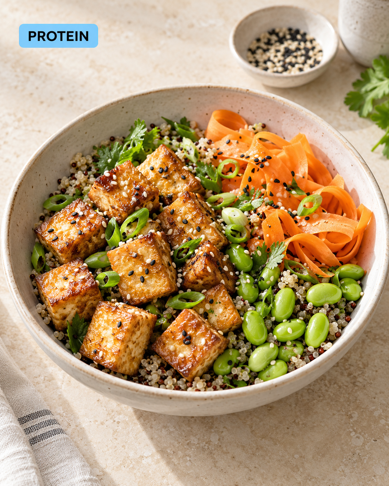

Croccantezza e colore, tutta vegetale.

**Pranzo / cena · 25 min · 1 porzione · Facile**

**Tag:** PROTEIN

Ricette con un ingrediente proteico centrale. Quantità di proteine e requisiti per eventuali claim nutrizionali non verificati.

### Ingredienti

- 180 g tofu compatto
- 50 g quinoa secca
- 80 g edamame sgusciati surgelati
- 80 g carota
- 5 g semi di sesamo
- 5 g olio EVO
- 10 ml salsa di soia a ridotto sale
- 10 ml succo di lime

### Preparazione

1. Sciacqua la quinoa e cuocila secondo confezione. Cuoci gli edamame secondo confezione.
2. Tampona il tofu, taglialo a cubetti e rosolalo con l’olio per 8–10 minuti, girandolo.
3. Aggiungi salsa di soia e lime e mescola per un minuto.
4. Componi la bowl con quinoa, tofu, edamame, carota lavata a nastri e sesamo.

**Il tocco in più:** Asciugare il tofu è il segreto della crosticina.

**Allergeni:** Soia, Sesamo, Possibile glutine nella salsa di soia

**CTA:** Scopri la ricetta

---

## M12 · Cous cous ceci e limone

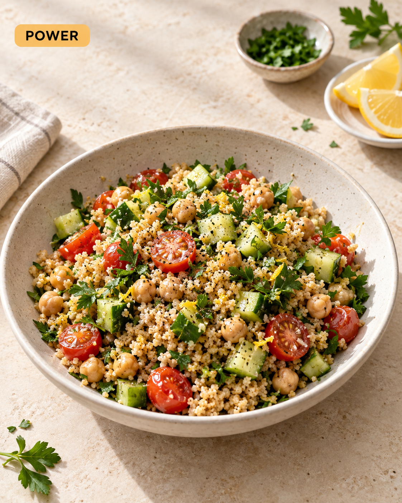

La pausa pranzo che sa di Mediterraneo.

**Pranzo / cena · 15 min · 1 porzione · Facile**

**Tag:** POWER

Pasti con cereali e altri ingredienti per accompagnare giornate attive. Nessuna promessa di aumento della forza.

### Ingredienti

- 60 g cous cous integrale secco
- 120 g ceci cotti scolati
- 100 g cetriolo
- 100 g pomodorini
- 5 g olio EVO
- 15 ml succo di limone
- Prezzemolo a piacere

### Preparazione

1. Reidrata il cous cous con acqua bollente nelle quantità e nei tempi della confezione.
2. Sgrana con una forchetta e lascia intiepidire.
3. Sciacqua i ceci; lava e taglia cetriolo e pomodorini.
4. Unisci tutto e condisci con olio, limone e prezzemolo tritato.

**Il tocco in più:** Sgrana prima di aggiungere le verdure.

**Allergeni:** Glutine

**CTA:** Scopri la ricetta

---

## M13 · Tagliata e crema di cannellini

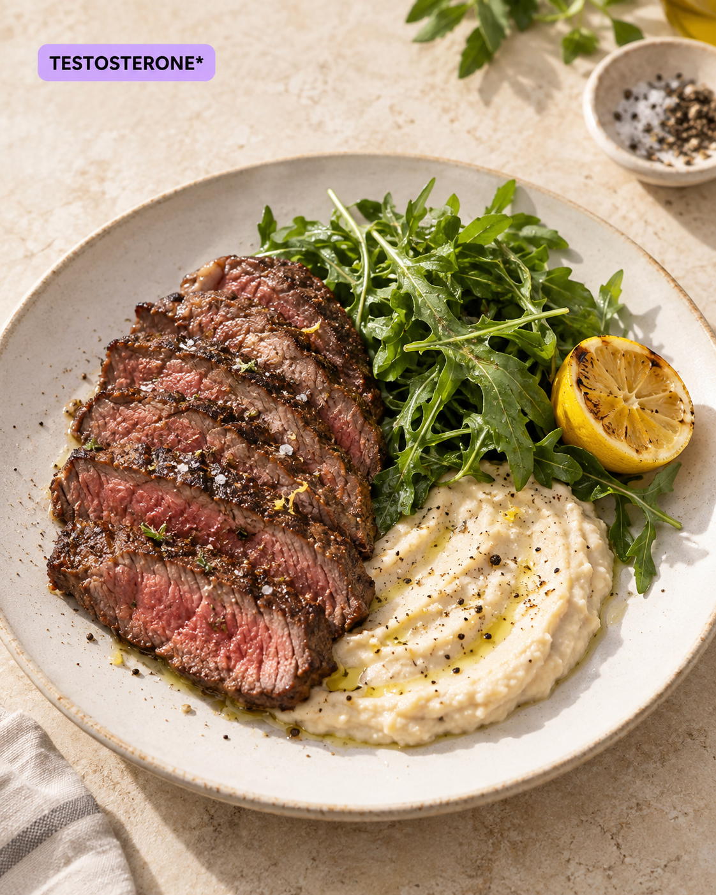

Una cena essenziale, dal gusto deciso.

**Pranzo / cena · 20 min · 1 porzione · Facile**

**Tag:** TESTOSTERONE*

Etichetta tematica richiesta, non beneficio dimostrato. Non è verificato che queste ricette aumentino il testosterone.

### Ingredienti

- 130 g bistecca magra di manzo cruda
- 130 g cannellini cotti scolati
- 40 g rucola
- 5 g olio EVO
- 15 ml succo di limone
- 30 ml acqua calda
- Rosmarino e pepe a piacere

### Preparazione

1. Sciacqua i cannellini, scaldali e frullali con acqua calda, metà olio e metà limone.
2. Scalda una padella e cuoci la bistecca su entrambi i lati fino a 63 °C al cuore.
3. Lascia riposare almeno 3 minuti, poi taglia a fette.
4. Servi sulla crema con rucola lavata, olio e limone rimasti e poco rosmarino.

**Il tocco in più:** Taglia la carne trasversalmente alle fibre.

**Allergeni:** Nessuno tra quelli degli ingredienti indicati; verificare etichette.

**CTA:** Scopri la ricetta

---

## M14 · Frittata spinaci e feta

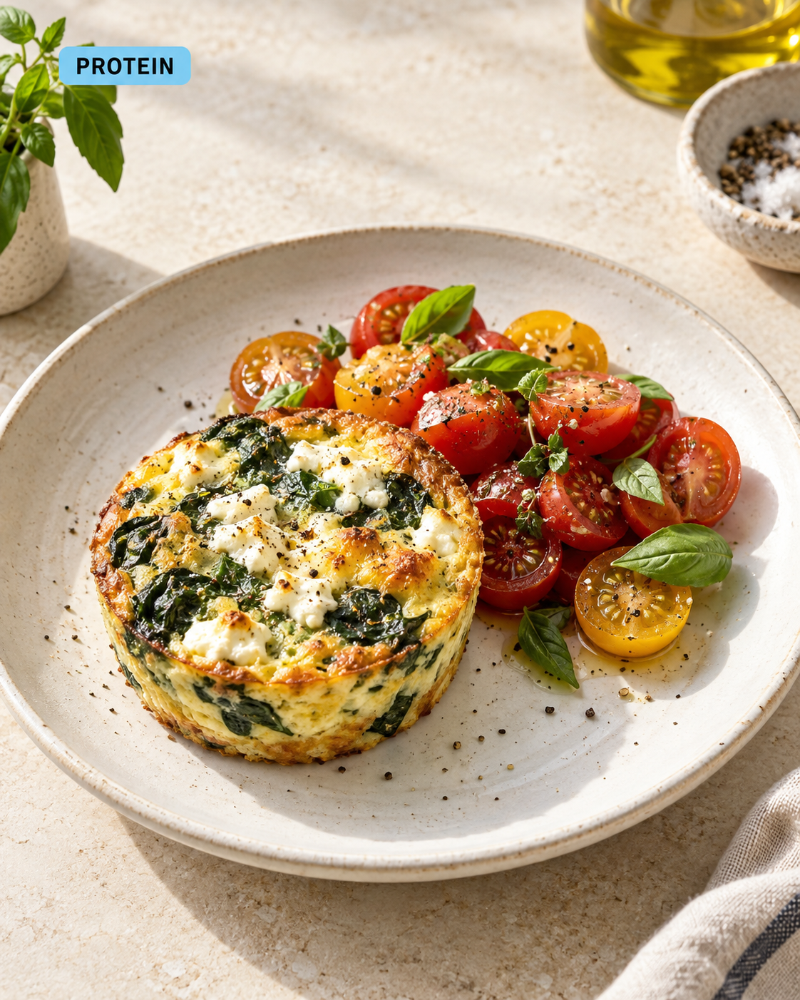

Morbida, saporita, pronta in padella.

**Pranzo / cena · 20 min · 1 porzione · Facile**

**Tag:** PROTEIN

Ricette con un ingrediente proteico centrale. Quantità di proteine e requisiti per eventuali claim nutrizionali non verificati.

### Ingredienti

- 2 uova medie
- 100 g albume pastorizzato
- 100 g spinaci freschi
- 30 g feta
- 100 g pomodorini
- 5 g olio EVO
- Pepe a piacere

### Preparazione

1. Lava gli spinaci e falli appassire 2–3 minuti in una padella piccola con olio.
2. Sbatti uova e albume, poi aggiungi feta sbriciolata e pepe.
3. Versa sugli spinaci, copri e cuoci a fuoco basso circa 8–10 minuti; gira aiutandoti con un piatto se necessario. Raggiungi 71 °C al centro.
4. Servi con pomodorini lavati e tagliati.

**Il tocco in più:** Fiamma bassa: il fondo non brucia mentre il centro cuoce.

**Allergeni:** Uova, Latte

**CTA:** Scopri la ricetta

---

## M15 · Merluzzo mediterraneo

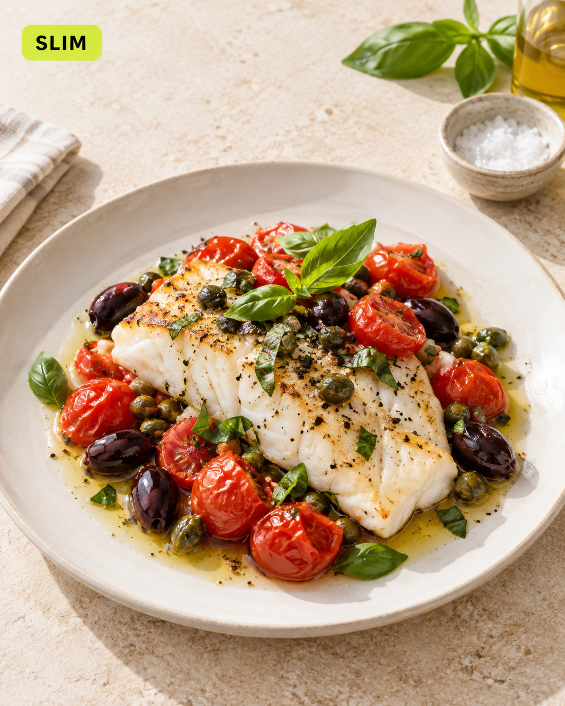

Pomodorini, olive e una scarpetta di profumi.

**Pranzo / cena · 20 min · 1 porzione · Facile**

**Tag:** SLIM

Selezione editoriale di piatti con porzioni definite e condimenti misurati. Non certifica basso contenuto calorico e non garantisce dimagrimento.

### Ingredienti

- 180 g filetto di merluzzo crudo
- 200 g pomodorini
- 15 g olive nere denocciolate
- 5 g capperi dissalati
- 5 g olio EVO
- Basilico e pepe a piacere

### Preparazione

1. Lava e taglia i pomodorini. Scaldali in padella con l’olio per 4 minuti.
2. Aggiungi il merluzzo, le olive e i capperi.
3. Copri e cuoci dolcemente circa 8–12 minuti, secondo lo spessore, fino a 63 °C al cuore.
4. Completa con basilico e pepe.

**Il tocco in più:** Se il fondo si asciuga aggiungi 1–2 cucchiai d’acqua.

**Allergeni:** Pesce

**CTA:** Scopri la ricetta

---

## M16 · Insalata croccante agrumi e ceci

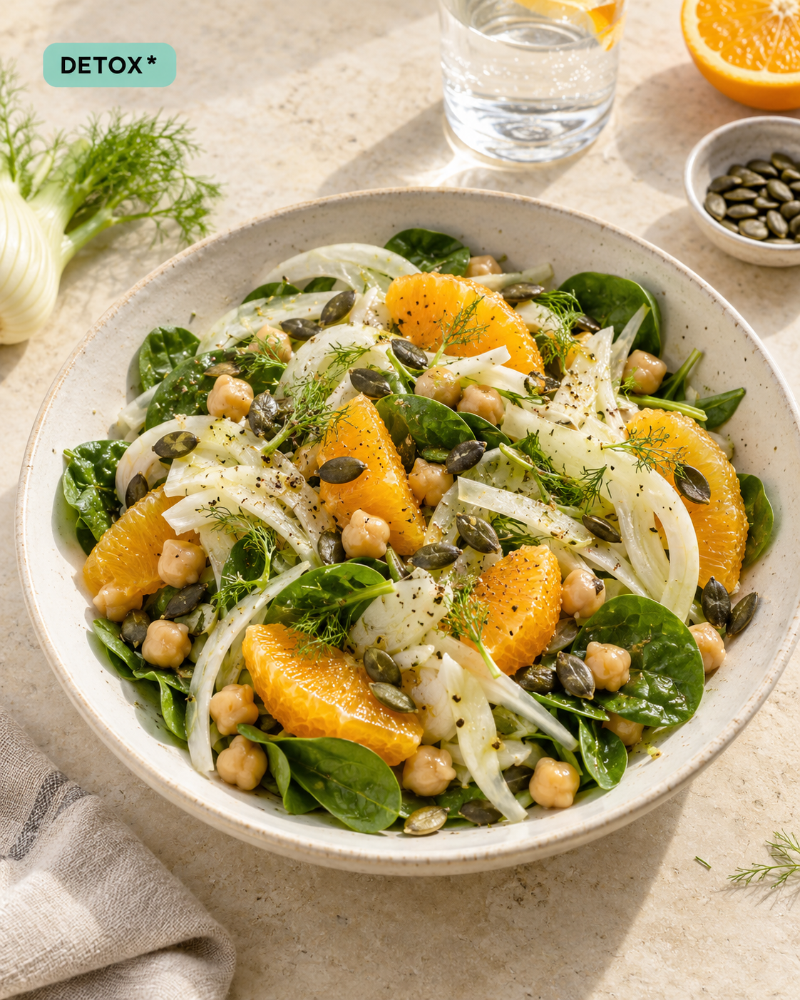

Freschezza vera, cucchiaio dopo cucchiaio.

**Pranzo leggero / contorno · 10 min · 1 porzione · Facile**

**Tag:** DETOX*

Etichetta tematica richiesta per ricette vegetali. Non significa eliminazione di tossine o purificazione dell’organismo.

### Ingredienti

- 150 g finocchio
- 120 g polpa di arancia
- 100 g ceci cotti scolati
- 40 g spinacino
- 10 g semi di zucca
- 5 g olio EVO
- 10 ml succo di limone

### Preparazione

1. Lava finocchio e spinacino. Affetta il finocchio sottile.
2. Pela l’arancia e ricava gli spicchi senza semi.
3. Sciacqua i ceci e uniscili alle verdure e all’arancia.
4. Condisci con olio e limone; completa con i semi.

**Il tocco in più:** Conserva gli spicchi interi per un contrasto piacevole.

**Allergeni:** Nessuno tra quelli degli ingredienti indicati; verificare etichette.

**CTA:** Scopri la ricetta

---

## M17 · Vellutata verde con yogurt

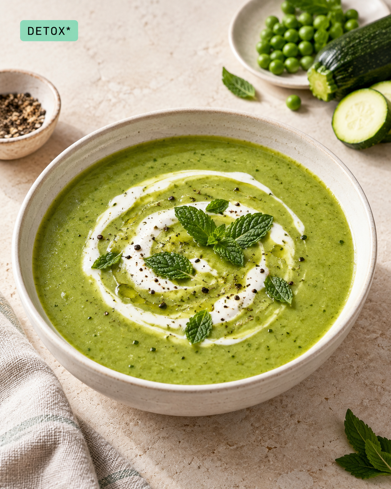

Un cucchiaio cremoso, un finale fresco.

**Pranzo leggero / primo · 25 min · 1 porzione · Facile**

**Tag:** DETOX*

Etichetta tematica richiesta per ricette vegetali. Non significa eliminazione di tossine o purificazione dell’organismo.

### Ingredienti

- 250 g zucchine
- 100 g piselli surgelati
- 100 g yogurt greco
- 30 g cipolla
- 200 ml acqua
- 5 g olio EVO
- Menta, pepe e sale a piacere

### Preparazione

1. Lava le zucchine e tagliale. Trita la cipolla.
2. Fai appassire la cipolla con olio e un cucchiaio d’acqua per 3 minuti.
3. Aggiungi zucchine, piselli e acqua restante; cuoci coperto per 12–15 minuti, rispettando anche i tempi dei piselli.
4. Frulla, regola di sale e pepe e servi con yogurt e menta.

**Il tocco in più:** Aggiungi lo yogurt fuori dal fuoco.

**Allergeni:** Latte

**CTA:** Scopri la ricetta

---

## M18 · Bowl lenticchie e barbabietola

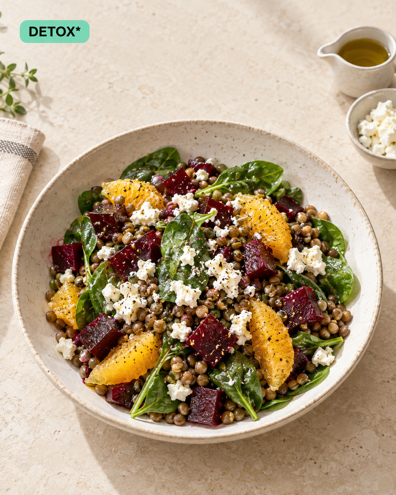

Terra, agrumi e una nota sapida.

**Pranzo / cena · 10 min · 1 porzione · Facile**

**Tag:** DETOX*

Etichetta tematica richiesta per ricette vegetali. Non significa eliminazione di tossine o purificazione dell’organismo.

### Ingredienti

- 150 g lenticchie cotte scolate
- 120 g barbabietola già cotta
- 50 g spinacino
- 100 g polpa di arancia
- 40 g feta
- 5 g olio EVO
- 10 ml succo di limone

### Preparazione

1. Sciacqua e scola le lenticchie.
2. Taglia la barbabietola a cubetti e l’arancia a spicchi.
3. Lava lo spinacino e disponilo in una ciotola con gli altri ingredienti.
4. Condisci con olio e limone e completa con feta sbriciolata.

**Il tocco in più:** Aggiungi la barbabietola alla fine per mantenere i colori separati.

**Allergeni:** Latte

**CTA:** Scopri la ricetta

---

## M19 · Mousse cacao e ricotta

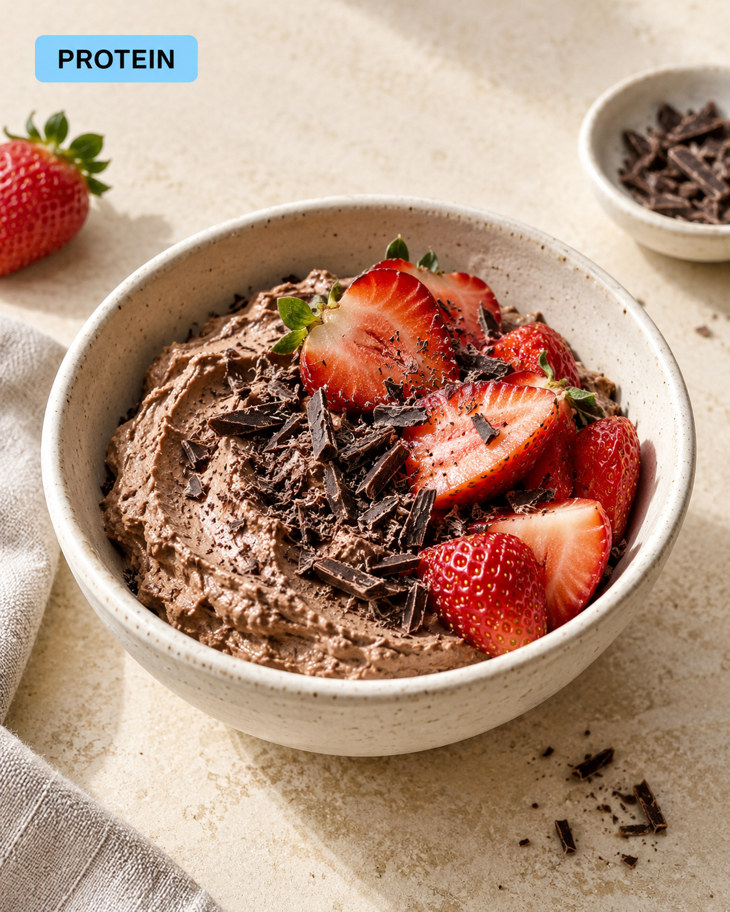

Il dessert cremoso che si fa in cinque minuti.

**Dessert / spuntino · 5 min · 1 porzione · Facile**

**Tag:** PROTEIN

Ricette con un ingrediente proteico centrale. Quantità di proteine e requisiti per eventuali claim nutrizionali non verificati.

### Ingredienti

- 100 g ricotta vaccina
- 100 g yogurt greco bianco
- 8 g cacao amaro
- 5 g miele
- 80 g fragole
- 5 g cioccolato fondente

### Preparazione

1. Frulla ricotta, yogurt, cacao e miele fino a ottenere una crema liscia.
2. Trasferisci in una coppetta.
3. Lava e taglia le fragole.
4. Completa con fragole e cioccolato a scaglie e servi.

**Il tocco in più:** Per una consistenza più compatta, lascia 20 minuti in frigo.

**Allergeni:** Latte

**CTA:** Scopri la ricetta

---

## M20 · Frozen yogurt frutti rossi

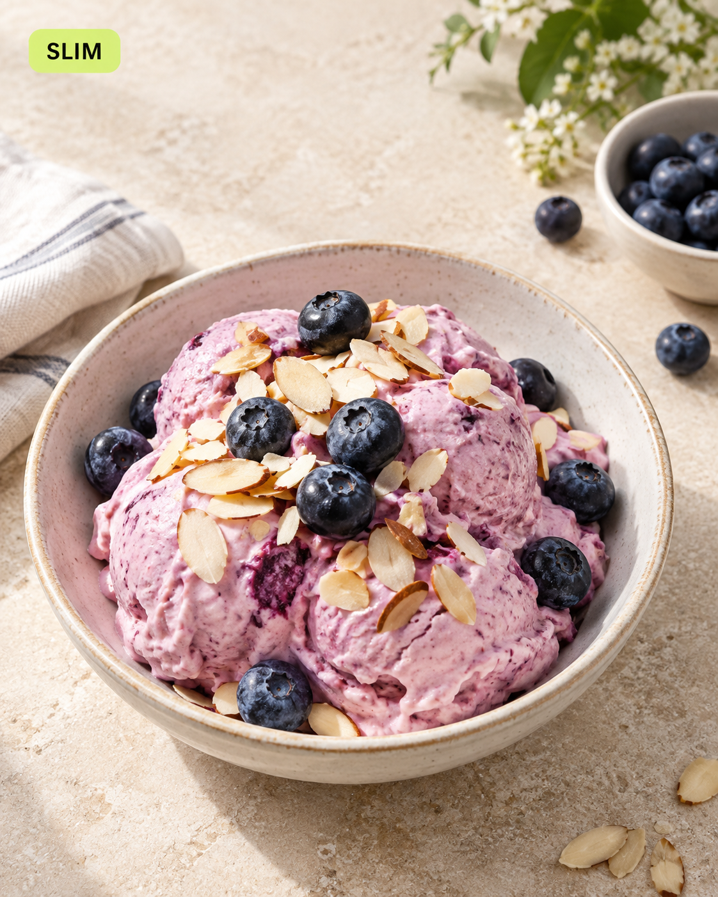

Fresco e goloso, senza gelatiera.

**Dessert / spuntino · 10 min + 4 ore freezer · 1 porzione · Facile**

**Tag:** SLIM

Selezione editoriale di piatti con porzioni definite e condimenti misurati. Non certifica basso contenuto calorico e non garantisce dimagrimento.

### Ingredienti

- 170 g yogurt greco bianco 0%
- 100 g fragole fresche
- 50 g mirtilli freschi
- 5 g miele
- 5 g mandorle a lamelle

### Preparazione

1. Lava e asciuga la frutta. Taglia le fragole e congelale con 30 g di mirtilli in un contenitore per almeno 4 ore.
2. Frulla la frutta congelata con yogurt e miele, a impulsi, usando un frullatore adatto.
3. Se necessario lascia ammorbidire la frutta 5 minuti: non aggiungere molta acqua.
4. Servi subito con i mirtilli rimasti e le mandorle.

**Il tocco in più:** La consistenza migliore si ottiene appena frullato.

**Allergeni:** Latte, Mandorle

**CTA:** Scopri la ricetta