# GYM WORKOUTS 20

## W01 · Forza total body

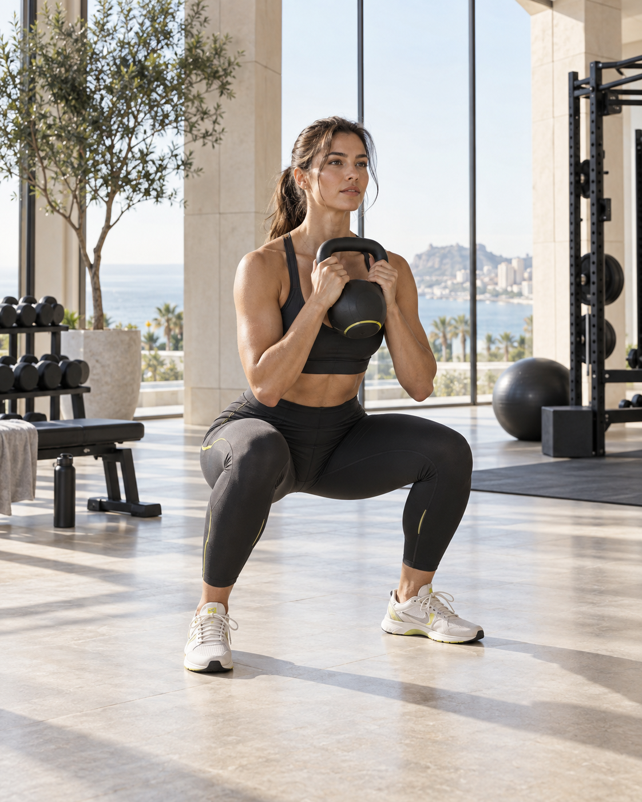

Quattro movimenti. Una base solida.

**Base · circa 30 min · RPE 5–6/10**

**Attrezzatura:** Kettlebell o manubrio, Panca stabile, Tappetino

**Riscaldamento · 4 min:** Marcia facile, mobilità dolce delle articolazioni coinvolte e una prova senza carico dei movimenti. Aumenta il ritmo gradualmente.

### Circuito · 3 giri

**Goblet squat — 8–10 ripetizioni**

Tieni un peso leggero vicino al petto, gomiti sotto il carico. Scendi con controllo senza perdere l’appoggio dei talloni e risali espirando.

Più facile: Esegui senza peso verso una panca.

Recupero tra esercizi: 45 s.

**Rematore con appoggio — 10 per lato**

Appoggia una mano su una panca stabile. Tieni schiena neutra e collo lungo; tira il manubrio verso il fianco senza ruotare il busto, poi scendi lentamente.

Più facile: Usa un manubrio più leggero.

Recupero tra esercizi: 45 s.

**Push-up inclinato — 8–10 ripetizioni**

Mani su una panca alta e stabile, corpo allineato. Avvicina il petto alla panca con gomiti obliqui, poi spingi senza inarcare la zona lombare.

Più facile: Esegui contro una parete.

Recupero tra esercizi: 45 s.

**Dead bug — 6 per lato**

Da supino porta ginocchia sopra le anche. Espira e allunga lentamente un braccio e la gamba opposta senza perdere il controllo del bacino; alterna.

Più facile: Muovi soltanto una gamba alla volta con un piccolo tocco del tallone.

Recupero tra esercizi: 45 s.

Recupero tra giri: 60 s (sostituisce la pausa dopo l’ultimo esercizio).

**Defaticamento · 3 min:** Rallenta con una camminata facile e movimenti dolci. Lascia tornare il respiro tranquillo.

**Progressione:** Ripeti mantenendo il controllo. Quando completi tutte le dosi con facilità, aumenta solo una variabile: poche ripetizioni oppure il minimo incremento di carico disponibile.

Scegli uno sforzo gestibile e respira durante i movimenti. Interrompi in caso di dolore, capogiro o malessere. In presenza di limitazioni, chiedi una variante al trainer.

**CTA:** Inizia allenamento

---

## W02 · Gambe e glutei

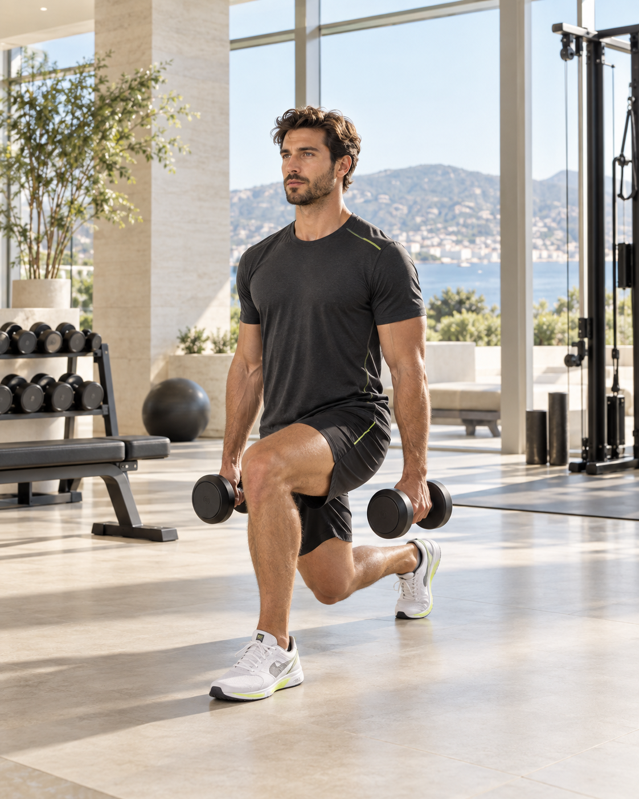

Controlla il movimento, senti ogni ripetizione.

**Intermedio · circa 35 min · RPE 5–6/10**

**Attrezzatura:** Manubri, Tappetino, Supporto stabile

**Riscaldamento · 4 min:** Marcia facile, mobilità dolce delle articolazioni coinvolte e una prova senza carico dei movimenti. Aumenta il ritmo gradualmente.

### Circuito · 3 giri

**Affondo indietro — 8 per lato**

Da eretto fai un passo indietro, piega entrambe le ginocchia quanto controlli e ritorna spingendo sul piede anteriore. Alterna le gambe.

Più facile: Tieni una mano su un supporto e riduci la discesa.

Recupero tra esercizi: 60 s.

**Stacco rumeno con manubri — 10 ripetizioni**

Ginocchia morbide e manubri vicini alle gambe. Spingi il bacino indietro mantenendo la schiena neutra; fermati prima di arrotondarla e torna in piedi.

Più facile: Impara il movimento senza carico, con un bastone lungo la schiena.

Recupero tra esercizi: 60 s.

**Ponte glutei — 12 ripetizioni**

Sdraiati con ginocchia piegate e piedi a terra. Solleva il bacino contraendo i glutei senza spingere in arco la schiena, poi scendi piano.

Più facile: Riduci l’altezza del sollevamento.

Recupero tra esercizi: 60 s.

**Sollevamento polpacci — 15 ripetizioni**

Vicino a un supporto stabile, sali lentamente sulle punte e torna con i talloni a terra senza rimbalzare.

Più facile: Appoggiati con entrambe le mani.

Recupero tra esercizi: 60 s.

Recupero tra giri: 60 s (sostituisce la pausa dopo l’ultimo esercizio).

**Defaticamento · 3 min:** Rallenta con una camminata facile e movimenti dolci. Lascia tornare il respiro tranquillo.

**Progressione:** Ripeti mantenendo il controllo. Quando completi tutte le dosi con facilità, aumenta solo una variabile: poche ripetizioni oppure il minimo incremento di carico disponibile.

Scegli uno sforzo gestibile e respira durante i movimenti. Interrompi in caso di dolore, capogiro o malessere. In presenza di limitazioni, chiedi una variante al trainer.

**CTA:** Inizia allenamento

---

## W03 · Upper body essenziale

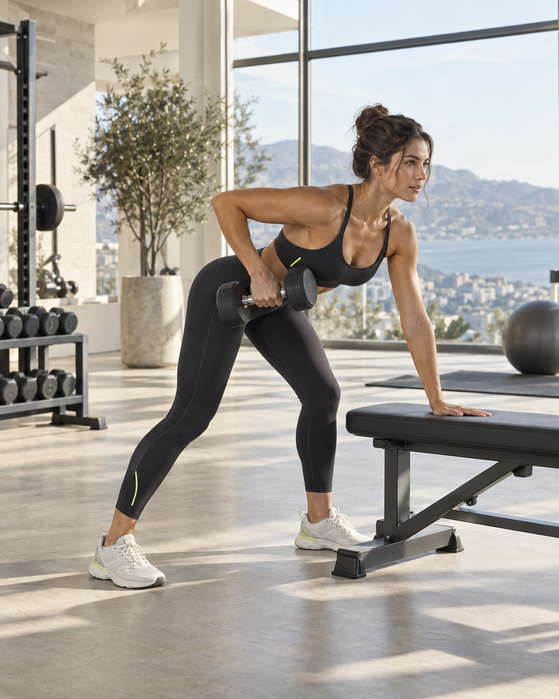

Spinta e tirata, con equilibrio.

**Base · circa 30 min · RPE 5–6/10**

**Attrezzatura:** Manubri, Panca stabile, Tappetino

**Riscaldamento · 4 min:** Marcia facile, mobilità dolce delle articolazioni coinvolte e una prova senza carico dei movimenti. Aumenta il ritmo gradualmente.

### Circuito · 3 giri

**Rematore con appoggio — 10 per lato**

Appoggia una mano su una panca stabile. Tieni schiena neutra e collo lungo; tira il manubrio verso il fianco senza ruotare il busto, poi scendi lentamente.

Più facile: Usa un manubrio più leggero.

Recupero tra esercizi: 45 s.

**Distensioni con manubri da terra — 10 ripetizioni**

Sdraiato con ginocchia piegate, gomiti obliqui rispetto al busto. Spingi i manubri sopra il petto e scendi fino a sfiorare il pavimento con le braccia.

Più facile: Usa carichi più leggeri.

Recupero tra esercizi: 45 s.

**Curl con manubri — 10 ripetizioni**

In piedi, gomiti vicino ai fianchi. Piega i gomiti senza oscillare con la schiena; scendi lentamente.

Più facile: Riduci il peso o alterna un braccio alla volta.

Recupero tra esercizi: 45 s.

**Bird dog — 6 per lato**

In quadrupedia, mani sotto le spalle e ginocchia sotto le anche. Allunga braccio e gamba opposti senza inarcare o ruotare il bacino, poi alterna.

Più facile: Solleva soltanto un arto alla volta.

Recupero tra esercizi: 45 s.

Recupero tra giri: 60 s (sostituisce la pausa dopo l’ultimo esercizio).

**Defaticamento · 3 min:** Rallenta con una camminata facile e movimenti dolci. Lascia tornare il respiro tranquillo.

**Progressione:** Ripeti mantenendo il controllo. Quando completi tutte le dosi con facilità, aumenta solo una variabile: poche ripetizioni oppure il minimo incremento di carico disponibile.

Scegli uno sforzo gestibile e respira durante i movimenti. Interrompi in caso di dolore, capogiro o malessere. In presenza di limitazioni, chiedi una variante al trainer.

**CTA:** Inizia allenamento

---

## W04 · Core e stabilità

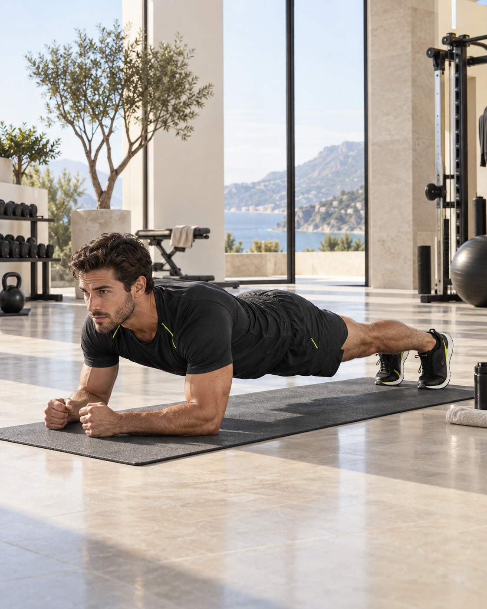

Il controllo parte dal centro.

**Base · circa 22 min · RPE 5–6/10**

**Attrezzatura:** Tappetino

**Riscaldamento · 3 min:** Marcia facile, mobilità dolce delle articolazioni coinvolte e una prova senza carico dei movimenti. Aumenta il ritmo gradualmente.

### Circuito · 3 giri

**Dead bug — 6 per lato**

Da supino porta ginocchia sopra le anche. Espira e allunga lentamente un braccio e la gamba opposta senza perdere il controllo del bacino; alterna.

Più facile: Muovi soltanto una gamba alla volta con un piccolo tocco del tallone.

Recupero tra esercizi: 30 s.

**Plank sugli avambracci — 20 secondi**

Gomiti sotto le spalle. Mantieni testa, bacino e talloni allineati, respira e interrompi la tenuta prima che la schiena ceda.

Più facile: Appoggia le ginocchia a terra.

Recupero tra esercizi: 30 s.

**Side plank con ginocchia a terra — 15 secondi per lato**

Sul fianco, gomito sotto la spalla e ginocchia piegate. Solleva il bacino senza ruotare il tronco e continua a respirare.

Più facile: Riduci la durata a 10 secondi.

Recupero tra esercizi: 30 s.

**Ponte glutei — 12 ripetizioni**

Sdraiati con ginocchia piegate e piedi a terra. Solleva il bacino contraendo i glutei senza spingere in arco la schiena, poi scendi piano.

Più facile: Riduci l’altezza del sollevamento.

Recupero tra esercizi: 30 s.

Recupero tra giri: 60 s (sostituisce la pausa dopo l’ultimo esercizio).

**Defaticamento · 3 min:** Rallenta con una camminata facile e movimenti dolci. Lascia tornare il respiro tranquillo.

**Progressione:** Ripeti mantenendo il controllo. Quando completi tutte le dosi con facilità, aumenta solo una variabile: poche ripetizioni oppure il minimo incremento di carico disponibile.

Scegli uno sforzo gestibile e respira durante i movimenti. Interrompi in caso di dolore, capogiro o malessere. In presenza di limitazioni, chiedi una variante al trainer.

**CTA:** Inizia allenamento

---

## W05 · Cardio a basso impatto

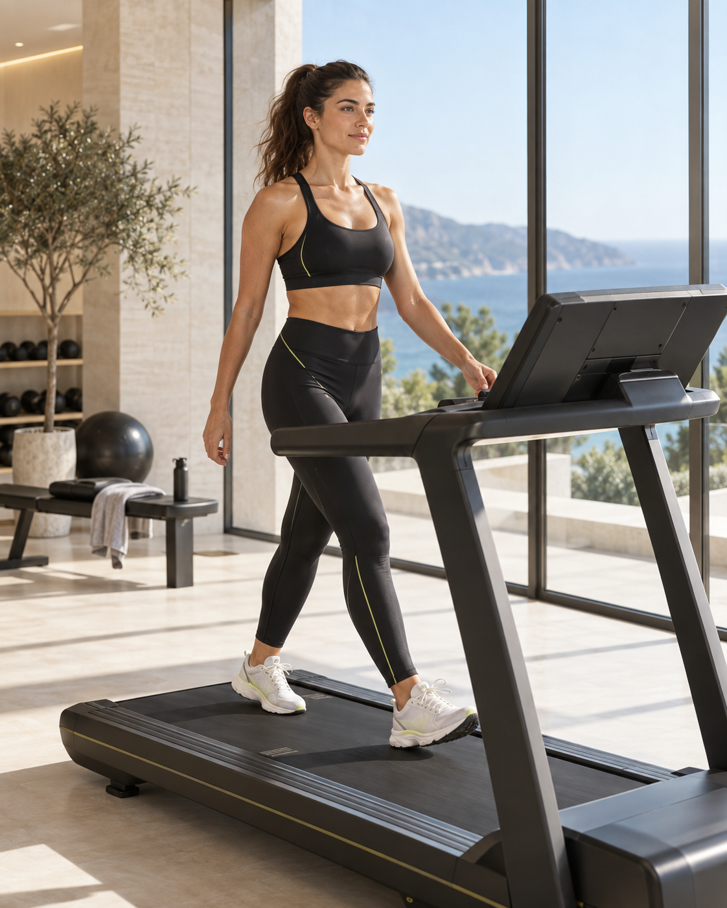

Trova il ritmo che puoi mantenere.

**Base · circa 30 min · RPE 4–5/10**

**Attrezzatura:** Tapis roulant o percorso piano

**Riscaldamento · 5 min:** Marcia facile, mobilità dolce delle articolazioni coinvolte e una prova senza carico dei movimenti. Aumenta il ritmo gradualmente.

### Circuito · 1 giri

**Camminata comoda — 20 minuti a ritmo sostenuto ma conversazionale**

Cammina a ritmo regolare, spalle rilassate e passi naturali. Sul tapis roulant scegli una velocità controllabile senza aggrapparti.

Più facile: Rallenta o cammina su terreno piano.

Recupero tra esercizi: 0 s.

Recupero tra giri: 60 s (sostituisce la pausa dopo l’ultimo esercizio).

**Defaticamento · 5 min:** Rallenta con una camminata facile e movimenti dolci. Lascia tornare il respiro tranquillo.

**Progressione:** Mantieni un ritmo gestibile. Aumenta gradualmente la durata solo quando la sessione risulta comoda; non aumentare insieme durata e intensità.

Scegli uno sforzo gestibile e respira durante i movimenti. Interrompi in caso di dolore, capogiro o malessere. In presenza di limitazioni, chiedi una variante al trainer.

**CTA:** Inizia allenamento

---

## W06 · HIIT senza salti

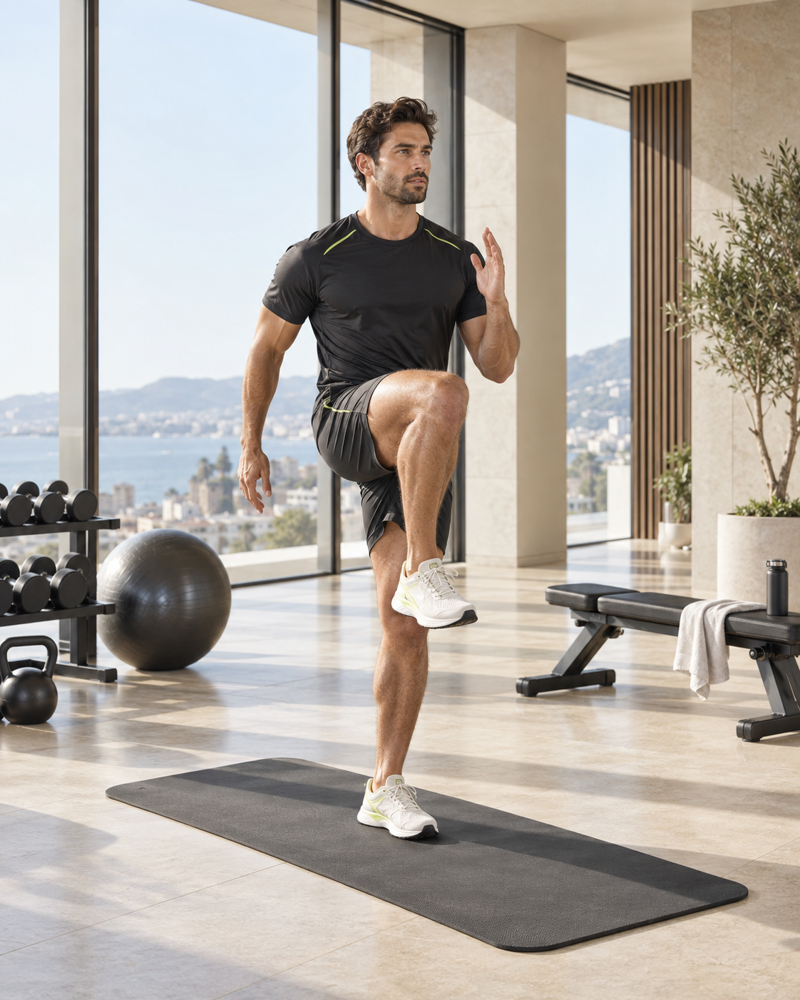

Intervalli brevi, piedi sempre sotto controllo.

**Intermedio · circa 24 min · RPE 6–7/10**

**Attrezzatura:** Spazio libero, Tappetino

**Riscaldamento · 5 min:** Marcia facile, mobilità dolce delle articolazioni coinvolte e una prova senza carico dei movimenti. Aumenta il ritmo gradualmente.

### Circuito · 4 giri

**Marcia attiva — 30 secondi**

Cammina sul posto con appoggi morbidi e braccia naturali. Solleva le ginocchia solo quanto riesci mantenendo il busto stabile.

Più facile: Rallenta il ritmo.

Recupero tra esercizi: 30 s.

**Step jack senza salto — 30 secondi**

Fai un passo laterale mentre apri le braccia entro un’ampiezza comoda; richiudi e cambia lato. Mantieni sempre un piede a terra.

Più facile: Tieni le mani ai fianchi.

Recupero tra esercizi: 30 s.

**Boxe a vuoto controllata — 30 secondi**

Piedi stabili e ginocchia morbide. Alterna colpi in avanti senza bloccare i gomiti, ruotando dolcemente il tronco; non usare pesi.

Più facile: Riduci velocità e ampiezza.

Recupero tra esercizi: 30 s.

**Ginocchia alternate in piedi — 30 secondi**

Solleva un ginocchio per volta verso il busto senza piegare la schiena; abbassa con controllo e alterna.

Più facile: Appoggia una mano a un supporto.

Recupero tra esercizi: 30 s.

Recupero tra giri: 0 s (sostituisce la pausa dopo l’ultimo esercizio).

**Defaticamento · 3 min:** Rallenta con una camminata facile e movimenti dolci. Lascia tornare il respiro tranquillo.

**Progressione:** Ripeti mantenendo il controllo. Quando completi tutte le dosi con facilità, aumenta solo una variabile: poche ripetizioni oppure il minimo incremento di carico disponibile.

Scegli uno sforzo gestibile e respira durante i movimenti. Interrompi in caso di dolore, capogiro o malessere. In presenza di limitazioni, chiedi una variante al trainer.

**CTA:** Inizia allenamento

---

## W07 · Manubri total body

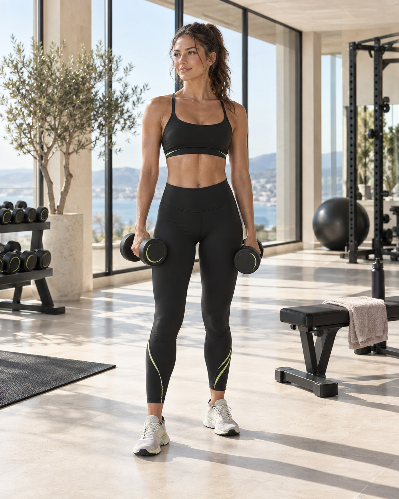

Due manubri, una sessione completa.

**Intermedio · circa 35 min · RPE 5–6/10**

**Attrezzatura:** Manubri, Panca stabile, Tappetino

**Riscaldamento · 4 min:** Marcia facile, mobilità dolce delle articolazioni coinvolte e una prova senza carico dei movimenti. Aumenta il ritmo gradualmente.

### Circuito · 3 giri

**Goblet squat — 10 ripetizioni**

Tieni un peso leggero vicino al petto, gomiti sotto il carico. Scendi con controllo senza perdere l’appoggio dei talloni e risali espirando.

Più facile: Esegui senza peso verso una panca.

Recupero tra esercizi: 60 s.

**Stacco rumeno con manubri — 10 ripetizioni**

Ginocchia morbide e manubri vicini alle gambe. Spingi il bacino indietro mantenendo la schiena neutra; fermati prima di arrotondarla e torna in piedi.

Più facile: Impara il movimento senza carico, con un bastone lungo la schiena.

Recupero tra esercizi: 60 s.

**Rematore con appoggio — 10 per lato**

Appoggia una mano su una panca stabile. Tieni schiena neutra e collo lungo; tira il manubrio verso il fianco senza ruotare il busto, poi scendi lentamente.

Più facile: Usa un manubrio più leggero.

Recupero tra esercizi: 60 s.

**Distensioni con manubri da terra — 10 ripetizioni**

Sdraiato con ginocchia piegate, gomiti obliqui rispetto al busto. Spingi i manubri sopra il petto e scendi fino a sfiorare il pavimento con le braccia.

Più facile: Usa carichi più leggeri.

Recupero tra esercizi: 60 s.

Recupero tra giri: 60 s (sostituisce la pausa dopo l’ultimo esercizio).

**Defaticamento · 3 min:** Rallenta con una camminata facile e movimenti dolci. Lascia tornare il respiro tranquillo.

**Progressione:** Ripeti mantenendo il controllo. Quando completi tutte le dosi con facilità, aumenta solo una variabile: poche ripetizioni oppure il minimo incremento di carico disponibile.

Scegli uno sforzo gestibile e respira durante i movimenti. Interrompi in caso di dolore, capogiro o malessere. In presenza di limitazioni, chiedi una variante al trainer.

**CTA:** Inizia allenamento

---

## W08 · Schiena e postura

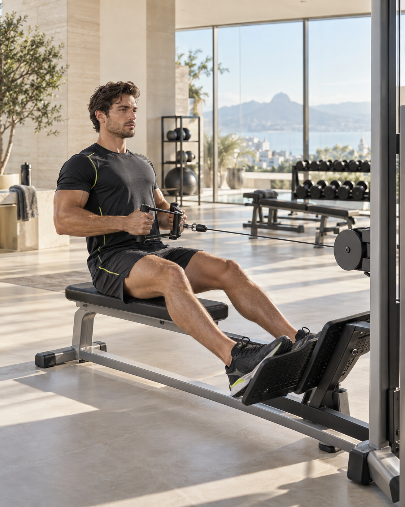

Più consapevolezza nei movimenti di tirata.

**Base · circa 25 min · RPE 5–6/10**

**Attrezzatura:** Macchina cavo basso, Parete, Tappetino

**Riscaldamento · 4 min:** Marcia facile, mobilità dolce delle articolazioni coinvolte e una prova senza carico dei movimenti. Aumenta il ritmo gradualmente.

### Circuito · 3 giri

**Rematore al cavo seduto — 10 ripetizioni**

Regola seduta e appoggi. Tira la maniglia verso l’addome mantenendo il torace stabile; ritorna senza incurvare la schiena.

Più facile: Riduci la resistenza e chiedi al trainer di regolare la macchina.

Recupero tra esercizi: 45 s.

**Scivolate delle braccia alla parete — 8 ripetizioni**

Appoggia delicatamente la schiena alla parete. Fai scorrere le braccia verso l’alto solo nell’ampiezza comoda, senza inarcare il busto.

Più facile: Riduci l’altezza raggiunta.

Recupero tra esercizi: 45 s.

**Bird dog — 6 per lato**

In quadrupedia, mani sotto le spalle e ginocchia sotto le anche. Allunga braccio e gamba opposti senza inarcare o ruotare il bacino, poi alterna.

Più facile: Solleva soltanto un arto alla volta.

Recupero tra esercizi: 45 s.

Recupero tra giri: 60 s (sostituisce la pausa dopo l’ultimo esercizio).

**Defaticamento · 3 min:** Rallenta con una camminata facile e movimenti dolci. Lascia tornare il respiro tranquillo.

**Progressione:** Ripeti mantenendo il controllo. Quando completi tutte le dosi con facilità, aumenta solo una variabile: poche ripetizioni oppure il minimo incremento di carico disponibile.

Scegli uno sforzo gestibile e respira durante i movimenti. Interrompi in caso di dolore, capogiro o malessere. In presenza di limitazioni, chiedi una variante al trainer.

**CTA:** Inizia allenamento

---

## W09 · Spinta e controllo

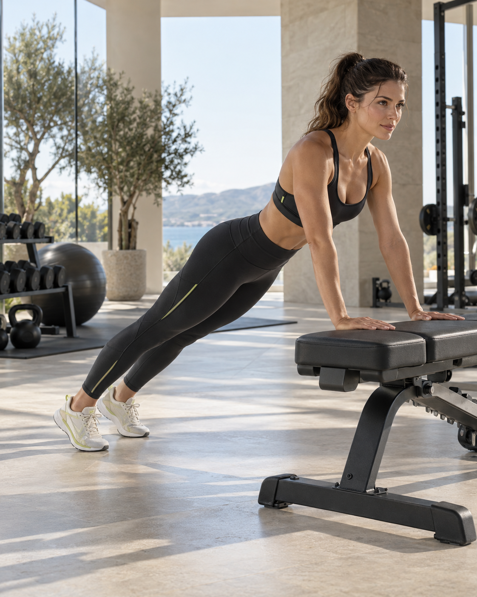

Una progressione accessibile per il tronco.

**Base · circa 25 min · RPE 5–6/10**

**Attrezzatura:** Panca stabile, Manubri, Tappetino

**Riscaldamento · 4 min:** Marcia facile, mobilità dolce delle articolazioni coinvolte e una prova senza carico dei movimenti. Aumenta il ritmo gradualmente.

### Circuito · 3 giri

**Push-up inclinato — 8 ripetizioni**

Mani su una panca alta e stabile, corpo allineato. Avvicina il petto alla panca con gomiti obliqui, poi spingi senza inarcare la zona lombare.

Più facile: Esegui contro una parete.

Recupero tra esercizi: 60 s.

**Distensioni con manubri da terra — 10 ripetizioni**

Sdraiato con ginocchia piegate, gomiti obliqui rispetto al busto. Spingi i manubri sopra il petto e scendi fino a sfiorare il pavimento con le braccia.

Più facile: Usa carichi più leggeri.

Recupero tra esercizi: 60 s.

**Plank sugli avambracci — 20 secondi**

Gomiti sotto le spalle. Mantieni testa, bacino e talloni allineati, respira e interrompi la tenuta prima che la schiena ceda.

Più facile: Appoggia le ginocchia a terra.

Recupero tra esercizi: 60 s.

Recupero tra giri: 60 s (sostituisce la pausa dopo l’ultimo esercizio).

**Defaticamento · 3 min:** Rallenta con una camminata facile e movimenti dolci. Lascia tornare il respiro tranquillo.

**Progressione:** Ripeti mantenendo il controllo. Quando completi tutte le dosi con facilità, aumenta solo una variabile: poche ripetizioni oppure il minimo incremento di carico disponibile.

Scegli uno sforzo gestibile e respira durante i movimenti. Interrompi in caso di dolore, capogiro o malessere. In presenza di limitazioni, chiedi una variante al trainer.

**CTA:** Inizia allenamento

---

## W10 · Glutei con miniband

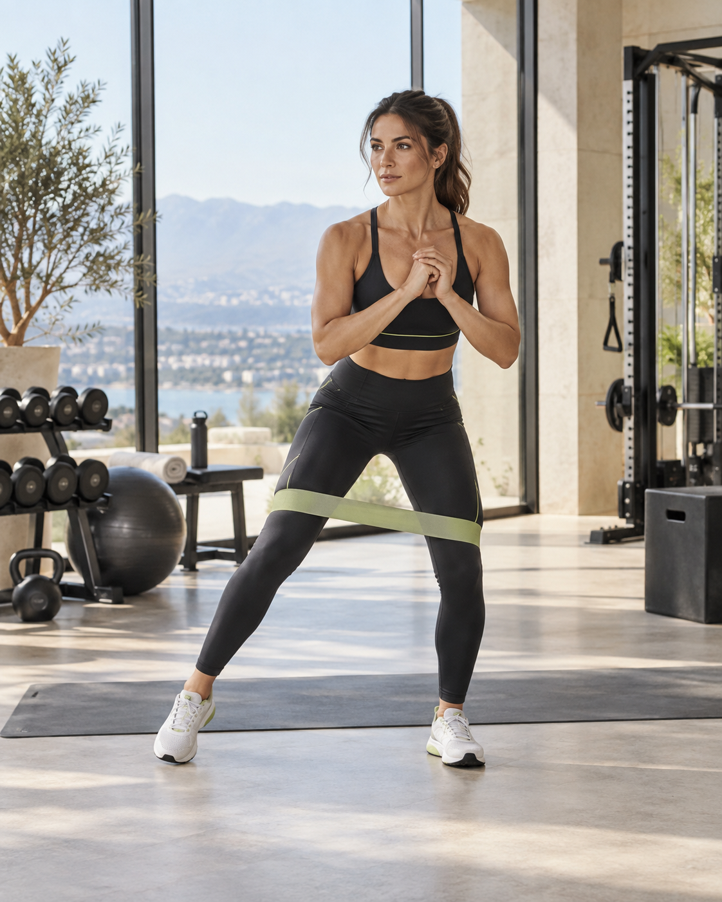

Piccoli movimenti, esecuzione precisa.

**Base · circa 22 min · RPE 5–6/10**

**Attrezzatura:** Miniband, Tappetino

**Riscaldamento · 4 min:** Marcia facile, mobilità dolce delle articolazioni coinvolte e una prova senza carico dei movimenti. Aumenta il ritmo gradualmente.

### Circuito · 3 giri

**Passi laterali con miniband — 8 passi per direzione**

Posiziona la miniband sopra le ginocchia, fletti leggermente anche e ginocchia. Fai piccoli passi laterali senza trascinare il piede e senza chiudere le ginocchia.

Più facile: Esegui senza elastico.

Recupero tra esercizi: 30 s.

**Ponte glutei — 12 ripetizioni**

Sdraiati con ginocchia piegate e piedi a terra. Solleva il bacino contraendo i glutei senza spingere in arco la schiena, poi scendi piano.

Più facile: Riduci l’altezza del sollevamento.

Recupero tra esercizi: 30 s.

**Aperture sul fianco — 10 per lato**

Sdraiato sul fianco con anche e ginocchia piegate e piedi uniti. Apri il ginocchio superiore senza ruotare il bacino e richiudi lentamente.

Più facile: Riduci l’ampiezza e togli l’elastico.

Recupero tra esercizi: 30 s.

Recupero tra giri: 60 s (sostituisce la pausa dopo l’ultimo esercizio).

**Defaticamento · 3 min:** Rallenta con una camminata facile e movimenti dolci. Lascia tornare il respiro tranquillo.

**Progressione:** Ripeti mantenendo il controllo. Quando completi tutte le dosi con facilità, aumenta solo una variabile: poche ripetizioni oppure il minimo incremento di carico disponibile.

Scegli uno sforzo gestibile e respira durante i movimenti. Interrompi in caso di dolore, capogiro o malessere. In presenza di limitazioni, chiedi una variante al trainer.

**CTA:** Inizia allenamento

---

## W11 · Mobilità quotidiana

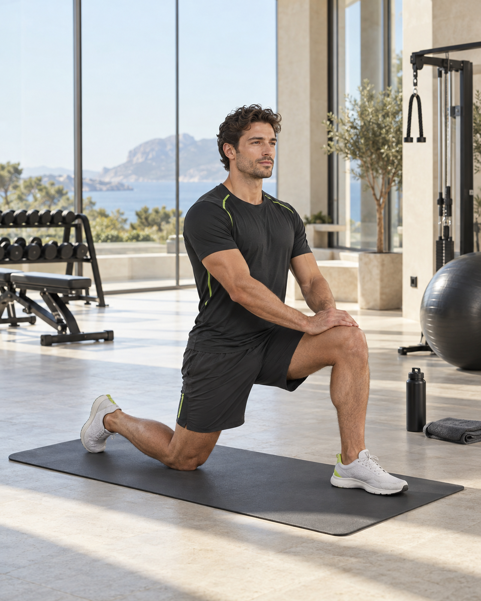

Muoviti con calma, esplora la tua ampiezza.

**Tutti i livelli · circa 18 min · RPE 2–3/10**

**Attrezzatura:** Tappetino, Supporto stabile

**Riscaldamento · 2 min:** Marcia facile, mobilità dolce delle articolazioni coinvolte e una prova senza carico dei movimenti. Aumenta il ritmo gradualmente.

### Circuito · 2 giri

**Mobilità della colonna in quadrupedia — 6 cicli lenti**

Da quattro appoggi alterna delicatamente arrotondamento e distensione della schiena, seguendo il respiro senza forzare il collo.

Più facile: Riduci il movimento.

Recupero tra esercizi: 15 s.

**Allungamento flessori dell’anca — 30 secondi per lato**

In mezzo inginocchio su tappetino, contrai leggermente il gluteo della gamba posteriore e porta il bacino poco avanti mantenendo il busto alto.

Più facile: Esegui in piedi con un passo lungo e supporto.

Recupero tra esercizi: 15 s.

**Rotazione toracica sul fianco — 6 per lato**

Sdraiato sul fianco con ginocchia piegate e sovrapposte. Apri lentamente il braccio superiore verso il lato opposto lasciando ferme le ginocchia.

Più facile: Apri il braccio solo parzialmente.

Recupero tra esercizi: 15 s.

**Mobilità caviglia — 8 per lato**

Con il piede ben appoggiato, porta il ginocchio avanti nella direzione del secondo dito senza staccare il tallone; torna indietro.

Più facile: Riduci l’avanzamento.

Recupero tra esercizi: 15 s.

Recupero tra giri: 60 s (sostituisce la pausa dopo l’ultimo esercizio).

**Defaticamento · 2 min:** Rallenta con una camminata facile e movimenti dolci. Lascia tornare il respiro tranquillo.

**Progressione:** Cerca maggiore controllo e continuità del respiro. Non forzare ampiezza o durata; ripeti nel tuo intervallo confortevole.

Scegli uno sforzo gestibile e respira durante i movimenti. Interrompi in caso di dolore, capogiro o malessere. In presenza di limitazioni, chiedi una variante al trainer.

**CTA:** Inizia allenamento

---

## W12 · Reset da scrivania

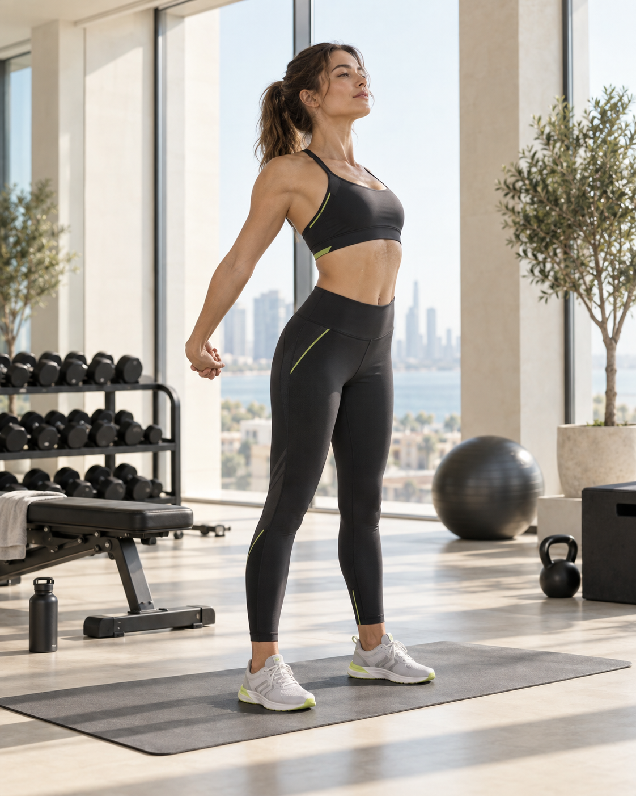

Una pausa attiva tra due impegni.

**Base · circa 12 min · RPE 2–3/10**

**Attrezzatura:** Sedia stabile, Parete

**Riscaldamento · 1 min:** Marcia facile, mobilità dolce delle articolazioni coinvolte e una prova senza carico dei movimenti. Aumenta il ritmo gradualmente.

### Circuito · 2 giri

**Apertura del petto — 30 secondi**

In piedi, apri le braccia e avvicina delicatamente le scapole senza spingere la testa avanti o forzare le spalle.

Più facile: Tieni le braccia più basse.

Recupero tra esercizi: 15 s.

**Rotazioni dolci del capo — 4 per lato**

Seduto o in piedi, ruota lentamente lo sguardo a destra e sinistra in un’ampiezza confortevole; evita circonduzioni e slanci.

Più facile: Riduci molto l’ampiezza.

Recupero tra esercizi: 15 s.

**Scivolate delle braccia alla parete — 6 ripetizioni**

Appoggia delicatamente la schiena alla parete. Fai scorrere le braccia verso l’alto solo nell’ampiezza comoda, senza inarcare il busto.

Più facile: Riduci l’altezza raggiunta.

Recupero tra esercizi: 15 s.

**Marcia attiva — 60 secondi**

Cammina sul posto con appoggi morbidi e braccia naturali. Solleva le ginocchia solo quanto riesci mantenendo il busto stabile.

Più facile: Rallenta il ritmo.

Recupero tra esercizi: 15 s.

Recupero tra giri: 60 s (sostituisce la pausa dopo l’ultimo esercizio).

**Defaticamento · 1 min:** Rallenta con una camminata facile e movimenti dolci. Lascia tornare il respiro tranquillo.

**Progressione:** Cerca maggiore controllo e continuità del respiro. Non forzare ampiezza o durata; ripeti nel tuo intervallo confortevole.

Scegli uno sforzo gestibile e respira durante i movimenti. Interrompi in caso di dolore, capogiro o malessere. In presenza di limitazioni, chiedi una variante al trainer.

**CTA:** Inizia allenamento

---

## W13 · Run walk starter

Alterna cammino e corsa senza inseguire il passo.

**Base già abituato a camminare · circa 30 min · RPE 4–6/10**

**Attrezzatura:** Scarpe adatte, Percorso piano

**Riscaldamento · 5 min:** Marcia facile, mobilità dolce delle articolazioni coinvolte e una prova senza carico dei movimenti. Aumenta il ritmo gradualmente.

### Circuito · 10 giri

**Intervallo corsa / cammino — 1 minuto di corsa facile + 1 minuto di camminata**

Corri piano per 1 minuto con passo naturale; cammina per 1 minuto. Ripeti 10 volte, senza sprint e mantenendo una respirazione controllabile.

Più facile: Sostituisci il minuto di corsa con camminata più vivace.

Recupero tra esercizi: 0 s.

Recupero tra giri: 0 s (sostituisce la pausa dopo l’ultimo esercizio).

**Defaticamento · 5 min:** Rallenta con una camminata facile e movimenti dolci. Lascia tornare il respiro tranquillo.

**Progressione:** Mantieni un ritmo gestibile. Aumenta gradualmente la durata solo quando la sessione risulta comoda; non aumentare insieme durata e intensità.

Scegli uno sforzo gestibile e respira durante i movimenti. Interrompi in caso di dolore, capogiro o malessere. In presenza di limitazioni, chiedi una variante al trainer.

**CTA:** Inizia allenamento

---

## W14 · Cycle intervals

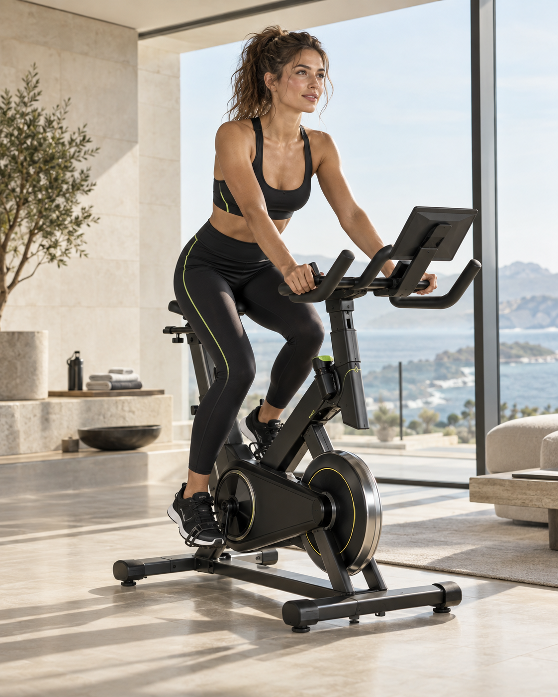

Cambia ritmo, mantieni il controllo.

**Base · circa 30 min · RPE 4–6/10**

**Attrezzatura:** Bike indoor regolata alla propria statura

**Riscaldamento · 5 min:** Pedala 5 minuti facili, aumentando dolcemente la resistenza.

### Circuito · 5 giri

**Intervallo in bike — 2 minuti moderati + 2 minuti facili**

Pedala seduto 2 minuti a resistenza moderata e 2 minuti facili. Ripeti 5 volte, senza sprint. Regola la bike con un trainer se non conosci le impostazioni.

Più facile: Mantieni tutti i minuti a ritmo facile.

Recupero tra esercizi: 0 s.

Recupero tra giri: 0 s (sostituisce la pausa dopo l’ultimo esercizio).

**Defaticamento · 5 min:** Pedala 5 minuti riducendo gradualmente la resistenza.

**Progressione:** Mantieni un ritmo gestibile. Aumenta gradualmente la durata solo quando la sessione risulta comoda; non aumentare insieme durata e intensità.

Scegli uno sforzo gestibile e respira durante i movimenti. Interrompi in caso di dolore, capogiro o malessere. In presenza di limitazioni, chiedi una variante al trainer.

**CTA:** Inizia allenamento

---

## W15 · Circuito kettlebell

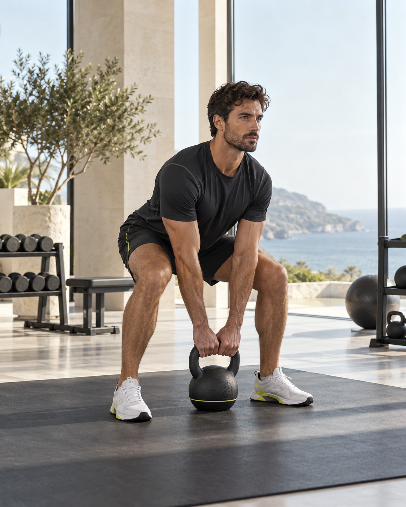

Semplice, solido, senza movimenti balistici.

**Intermedio · circa 30 min · RPE 5–6/10**

**Attrezzatura:** Kettlebell leggero, Tappetino

**Riscaldamento · 4 min:** Marcia facile, mobilità dolce delle articolazioni coinvolte e una prova senza carico dei movimenti. Aumenta il ritmo gradualmente.

### Circuito · 3 giri

**Stacco kettlebell — 10 ripetizioni**

Kettlebell tra i piedi, bacino indietro e schiena neutra. Afferra il manico con due mani e alzati spingendo sui piedi; appoggia con controllo.

Più facile: Usa un rialzo stabile per accorciare la discesa, con supervisione.

Recupero tra esercizi: 60 s.

**Goblet squat — 8 ripetizioni**

Tieni un peso leggero vicino al petto, gomiti sotto il carico. Scendi con controllo senza perdere l’appoggio dei talloni e risali espirando.

Più facile: Esegui senza peso verso una panca.

Recupero tra esercizi: 60 s.

**Marcia con carico su un lato — 30 secondi per lato**

Tieni un peso leggero a un fianco. Marcia lentamente mantenendo spalle e bacino orizzontali; cambia lato dopo la dose prevista.

Più facile: Mantieni la posizione ferma o riduci il carico.

Recupero tra esercizi: 60 s.

**Bird dog — 6 per lato**

In quadrupedia, mani sotto le spalle e ginocchia sotto le anche. Allunga braccio e gamba opposti senza inarcare o ruotare il bacino, poi alterna.

Più facile: Solleva soltanto un arto alla volta.

Recupero tra esercizi: 60 s.

Recupero tra giri: 60 s (sostituisce la pausa dopo l’ultimo esercizio).

**Defaticamento · 3 min:** Rallenta con una camminata facile e movimenti dolci. Lascia tornare il respiro tranquillo.

**Progressione:** Ripeti mantenendo il controllo. Quando completi tutte le dosi con facilità, aumenta solo una variabile: poche ripetizioni oppure il minimo incremento di carico disponibile.

Scegli uno sforzo gestibile e respira durante i movimenti. Interrompi in caso di dolore, capogiro o malessere. In presenza di limitazioni, chiedi una variante al trainer.

**CTA:** Inizia allenamento

---

## W16 · Corpo libero easy

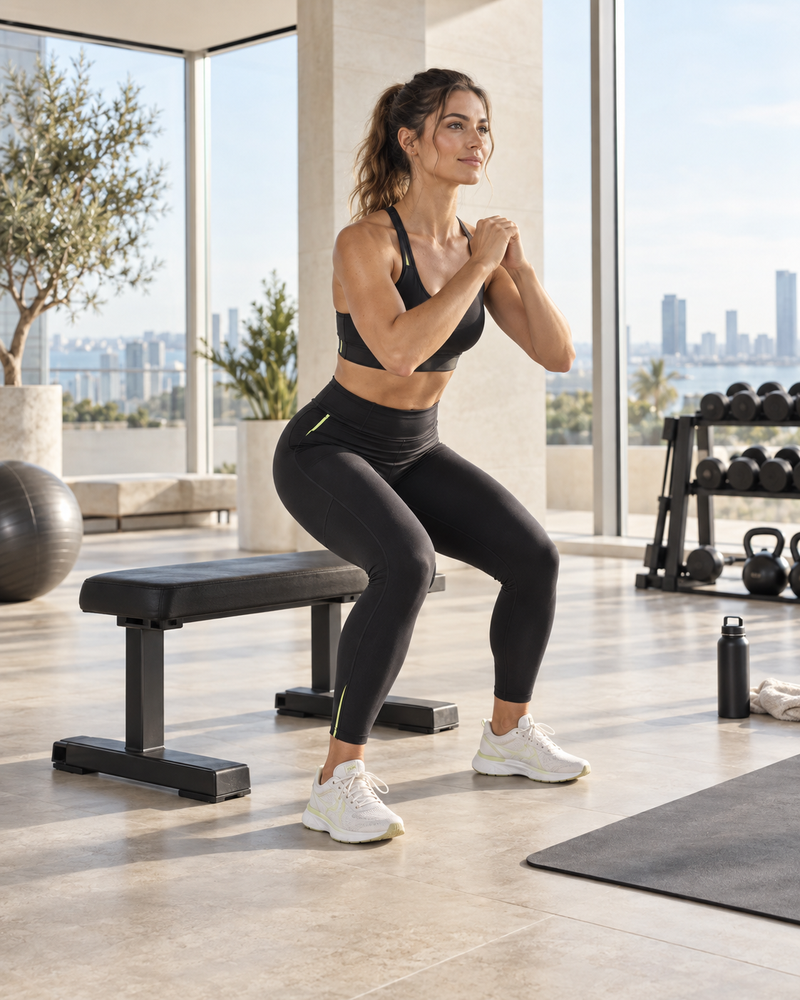

Inizia da ciò che riesci a controllare.

**Principiante · circa 20 min · RPE 3–5/10**

**Attrezzatura:** Panca stabile, Parete, Tappetino

**Riscaldamento · 4 min:** Marcia facile, mobilità dolce delle articolazioni coinvolte e una prova senza carico dei movimenti. Aumenta il ritmo gradualmente.

### Circuito · 2 giri

**Squat a corpo libero — 8 ripetizioni verso panca**

Piedi stabili, circa alla larghezza delle spalle. Porta il bacino indietro e piega le ginocchia seguendo la direzione dei piedi; risali spingendo sul piede intero.

Più facile: Siediti e rialzati da una panca stabile.

Recupero tra esercizi: 45 s.

**Push-up inclinato — 8 ripetizioni alla parete**

Mani su una panca alta e stabile, corpo allineato. Avvicina il petto alla panca con gomiti obliqui, poi spingi senza inarcare la zona lombare.

Più facile: Esegui contro una parete.

Recupero tra esercizi: 45 s.

**Ponte glutei — 10 ripetizioni**

Sdraiati con ginocchia piegate e piedi a terra. Solleva il bacino contraendo i glutei senza spingere in arco la schiena, poi scendi piano.

Più facile: Riduci l’altezza del sollevamento.

Recupero tra esercizi: 45 s.

**Marcia attiva — 60 secondi**

Cammina sul posto con appoggi morbidi e braccia naturali. Solleva le ginocchia solo quanto riesci mantenendo il busto stabile.

Più facile: Rallenta il ritmo.

Recupero tra esercizi: 45 s.

Recupero tra giri: 60 s (sostituisce la pausa dopo l’ultimo esercizio).

**Defaticamento · 3 min:** Rallenta con una camminata facile e movimenti dolci. Lascia tornare il respiro tranquillo.

**Progressione:** Ripeti mantenendo il controllo. Quando completi tutte le dosi con facilità, aumenta solo una variabile: poche ripetizioni oppure il minimo incremento di carico disponibile.

Scegli uno sforzo gestibile e respira durante i movimenti. Interrompi in caso di dolore, capogiro o malessere. In presenza di limitazioni, chiedi una variante al trainer.

**CTA:** Inizia allenamento

---

## W17 · Pilates core flow

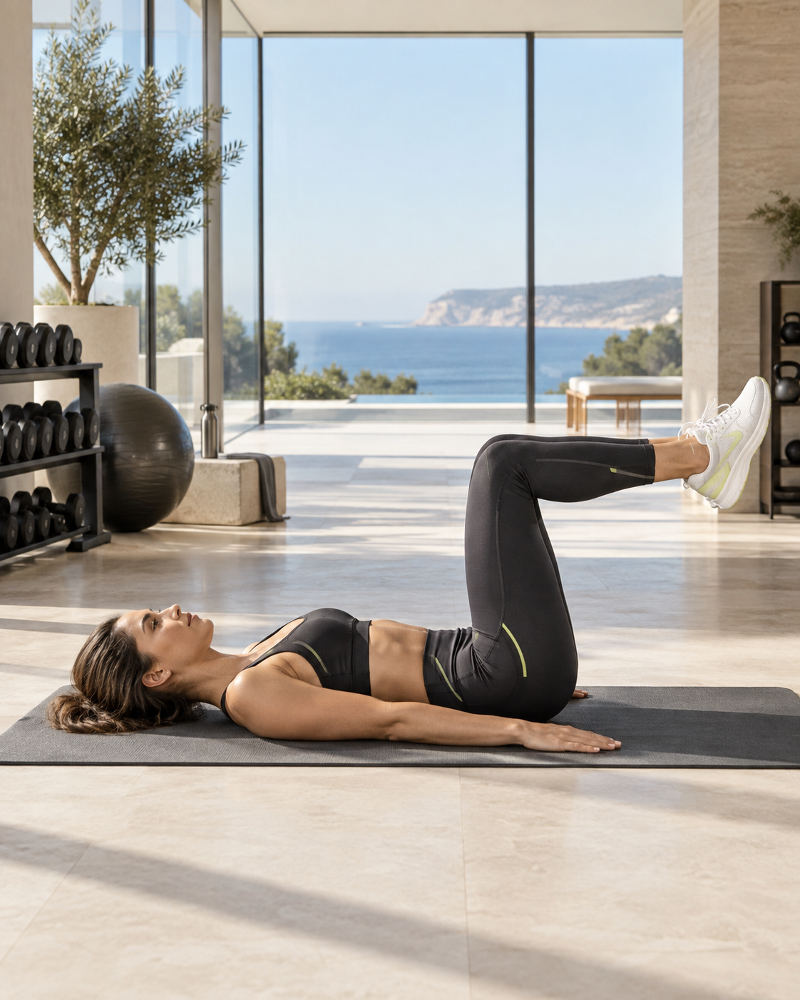

Respira, allinea, muoviti lentamente.

**Base · circa 22 min · RPE 3–5/10**

**Attrezzatura:** Tappetino

**Riscaldamento · 4 min:** Marcia facile, mobilità dolce delle articolazioni coinvolte e una prova senza carico dei movimenti. Aumenta il ritmo gradualmente.

### Circuito · 3 giri

**Toe tap da tabletop — 6 per lato**

Da supino, ginocchia piegate sopra le anche. Abbassa un piede fino a un piccolo tocco a terra, torna e alterna senza perdere controllo del bacino.

Più facile: Tieni un piede sempre appoggiato.

Recupero tra esercizi: 20 s.

**Ponte glutei — 10 ripetizioni**

Sdraiati con ginocchia piegate e piedi a terra. Solleva il bacino contraendo i glutei senza spingere in arco la schiena, poi scendi piano.

Più facile: Riduci l’altezza del sollevamento.

Recupero tra esercizi: 20 s.

**Bird dog — 6 per lato**

In quadrupedia, mani sotto le spalle e ginocchia sotto le anche. Allunga braccio e gamba opposti senza inarcare o ruotare il bacino, poi alterna.

Più facile: Solleva soltanto un arto alla volta.

Recupero tra esercizi: 20 s.

**Allungamento laterale da seduto — 20 secondi per lato**

Siediti comodamente, alza un braccio e inclina dolcemente il tronco dal lato opposto mantenendo il bacino appoggiato.

Più facile: Tieni il braccio più basso.

Recupero tra esercizi: 20 s.

Recupero tra giri: 60 s (sostituisce la pausa dopo l’ultimo esercizio).

**Defaticamento · 3 min:** Rallenta con una camminata facile e movimenti dolci. Lascia tornare il respiro tranquillo.

**Progressione:** Cerca maggiore controllo e continuità del respiro. Non forzare ampiezza o durata; ripeti nel tuo intervallo confortevole.

Scegli uno sforzo gestibile e respira durante i movimenti. Interrompi in caso di dolore, capogiro o malessere. In presenza di limitazioni, chiedi una variante al trainer.

**CTA:** Inizia allenamento

---

## W18 · Equilibrio e controllo

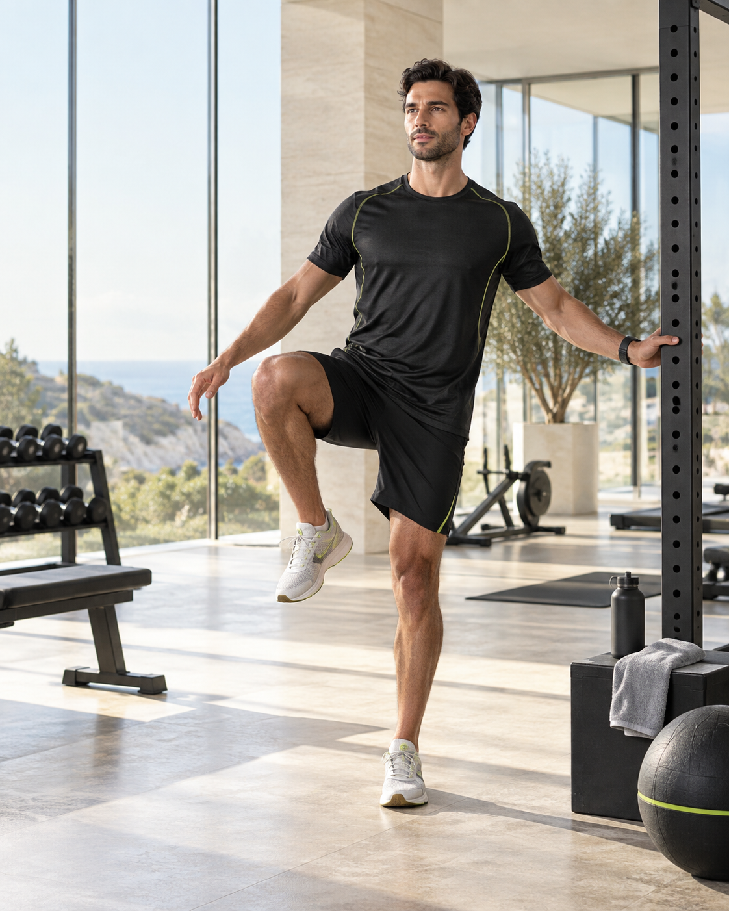

Stabilità prima della velocità.

**Base · circa 18 min · RPE 3–4/10**

**Attrezzatura:** Supporto stabile, Percorso libero

**Riscaldamento · 4 min:** Marcia facile, mobilità dolce delle articolazioni coinvolte e una prova senza carico dei movimenti. Aumenta il ritmo gradualmente.

### Circuito · 3 giri

**Equilibrio monopodalico — 20 secondi per lato**

Vicino a un supporto stabile, solleva un piede di poco e mantieni bacino livellato e sguardo avanti. Cambia gamba.

Più facile: Tieni un dito sul supporto.

Recupero tra esercizi: 30 s.

**Passi in linea — 8 passi**

Cammina lentamente mettendo il tallone vicino alla punta del piede opposto, lungo un percorso libero accanto a una parete.

Più facile: Lascia più spazio laterale tra i piedi.

Recupero tra esercizi: 30 s.

**Sollevamento polpacci — 10 ripetizioni**

Vicino a un supporto stabile, sali lentamente sulle punte e torna con i talloni a terra senza rimbalzare.

Più facile: Appoggiati con entrambe le mani.

Recupero tra esercizi: 30 s.

Recupero tra giri: 60 s (sostituisce la pausa dopo l’ultimo esercizio).

**Defaticamento · 3 min:** Rallenta con una camminata facile e movimenti dolci. Lascia tornare il respiro tranquillo.

**Progressione:** Cerca maggiore controllo e continuità del respiro. Non forzare ampiezza o durata; ripeti nel tuo intervallo confortevole.

Scegli uno sforzo gestibile e respira durante i movimenti. Interrompi in caso di dolore, capogiro o malessere. In presenza di limitazioni, chiedi una variante al trainer.

**CTA:** Inizia allenamento

---

## W19 · Recovery flow

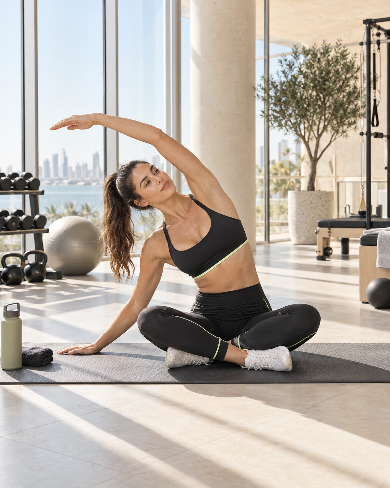

Un ritmo più lento per la tua giornata.

**Tutti i livelli · circa 16 min · RPE 1–3/10**

**Attrezzatura:** Tappetino

**Riscaldamento · 2 min:** Marcia facile, mobilità dolce delle articolazioni coinvolte e una prova senza carico dei movimenti. Aumenta il ritmo gradualmente.

### Circuito · 2 giri

**Mobilità della colonna in quadrupedia — 6 cicli lenti**

Da quattro appoggi alterna delicatamente arrotondamento e distensione della schiena, seguendo il respiro senza forzare il collo.

Più facile: Riduci il movimento.

Recupero tra esercizi: 15 s.

**Rotazione toracica sul fianco — 5 per lato**

Sdraiato sul fianco con ginocchia piegate e sovrapposte. Apri lentamente il braccio superiore verso il lato opposto lasciando ferme le ginocchia.

Più facile: Apri il braccio solo parzialmente.

Recupero tra esercizi: 15 s.

**Allungamento laterale da seduto — 30 secondi per lato**

Siediti comodamente, alza un braccio e inclina dolcemente il tronco dal lato opposto mantenendo il bacino appoggiato.

Più facile: Tieni il braccio più basso.

Recupero tra esercizi: 15 s.

**Respirazione tranquilla — 60 secondi**

Siediti o sdraiati comodamente. Inspira ed espira in modo naturale senza trattenere il fiato o forzare respiri profondi.

Più facile: Mantieni semplicemente il tuo respiro abituale.

Recupero tra esercizi: 15 s.

Recupero tra giri: 60 s (sostituisce la pausa dopo l’ultimo esercizio).

**Defaticamento · 2 min:** Rallenta con una camminata facile e movimenti dolci. Lascia tornare il respiro tranquillo.

**Progressione:** Cerca maggiore controllo e continuità del respiro. Non forzare ampiezza o durata; ripeti nel tuo intervallo confortevole.

Scegli uno sforzo gestibile e respira durante i movimenti. Interrompi in caso di dolore, capogiro o malessere. In presenza di limitazioni, chiedi una variante al trainer.

**CTA:** Inizia allenamento

---

## W20 · Express total body

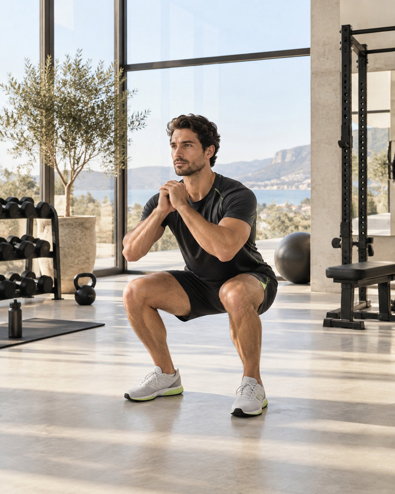

Poco tempo, una sequenza chiara.

**Base · circa 15 min · RPE 5–6/10**

**Attrezzatura:** Panca stabile, Tappetino

**Riscaldamento · 3 min:** Marcia facile, mobilità dolce delle articolazioni coinvolte e una prova senza carico dei movimenti. Aumenta il ritmo gradualmente.

### Circuito · 2 giri

**Squat a corpo libero — 10 ripetizioni**

Piedi stabili, circa alla larghezza delle spalle. Porta il bacino indietro e piega le ginocchia seguendo la direzione dei piedi; risali spingendo sul piede intero.

Più facile: Siediti e rialzati da una panca stabile.

Recupero tra esercizi: 20 s.

**Push-up inclinato — 8 ripetizioni**

Mani su una panca alta e stabile, corpo allineato. Avvicina il petto alla panca con gomiti obliqui, poi spingi senza inarcare la zona lombare.

Più facile: Esegui contro una parete.

Recupero tra esercizi: 20 s.

**Ponte glutei — 10 ripetizioni**

Sdraiati con ginocchia piegate e piedi a terra. Solleva il bacino contraendo i glutei senza spingere in arco la schiena, poi scendi piano.

Più facile: Riduci l’altezza del sollevamento.

Recupero tra esercizi: 20 s.

**Bird dog — 5 per lato**

In quadrupedia, mani sotto le spalle e ginocchia sotto le anche. Allunga braccio e gamba opposti senza inarcare o ruotare il bacino, poi alterna.

Più facile: Solleva soltanto un arto alla volta.

Recupero tra esercizi: 20 s.

Recupero tra giri: 60 s (sostituisce la pausa dopo l’ultimo esercizio).

**Defaticamento · 2 min:** Rallenta con una camminata facile e movimenti dolci. Lascia tornare il respiro tranquillo.

**Progressione:** Ripeti mantenendo il controllo. Quando completi tutte le dosi con facilità, aumenta solo una variabile: poche ripetizioni oppure il minimo incremento di carico disponibile.

Scegli uno sforzo gestibile e respira durante i movimenti. Interrompi in caso di dolore, capogiro o malessere. In presenza di limitazioni, chiedi una variante al trainer.

**CTA:** Inizia allenamento